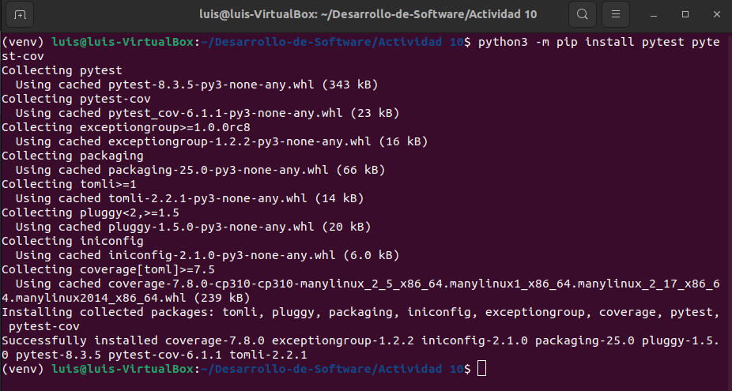
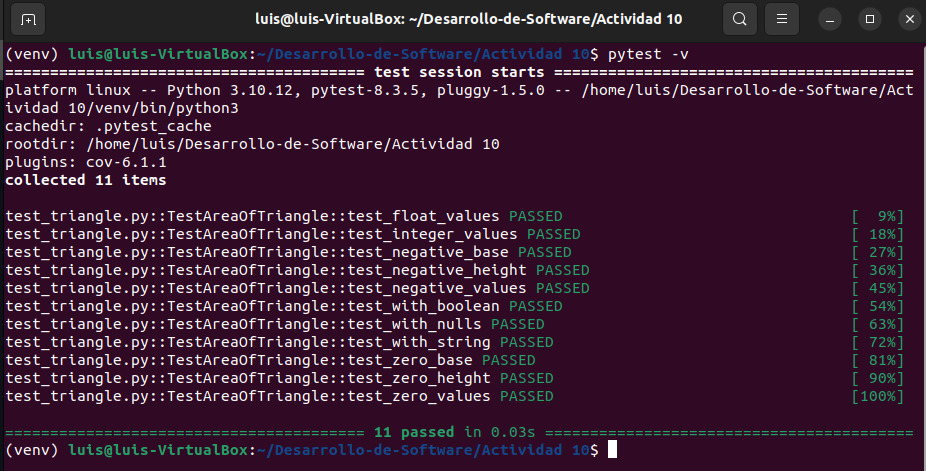
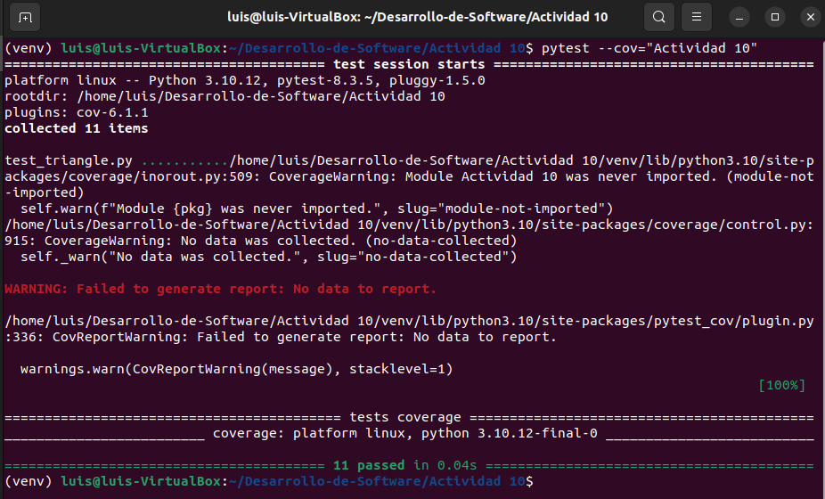
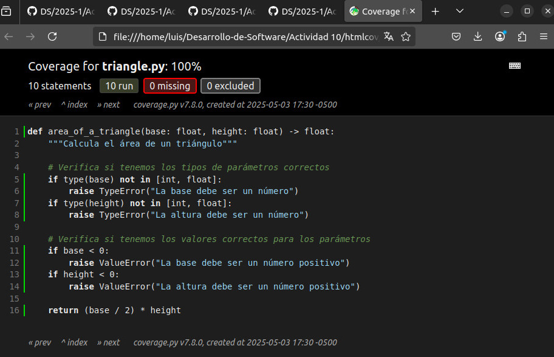

# Actividad 10

## Actividad: Ejecutar pruebas con pytest

### Paso 1: Instalando pytest y pytest-cov

Estando en un entorno virtual, llamado `venv`, instalamos `pytest` y `pytest-cov`. El primero para ejecutar pruebas y el segundo para poder generar informes de cobertura.

### Paso 2: Escribiendo y ejecutando pruebas con pytest

Se puede ejecutar pruebas ejecutando `pytest`. Si acompañamos dicho comando con `-v` tendremos más información del test, mostrando por ejemplo que pruebas fueron ejecutadas y cuales no.

### Paso 3: Añadiendo cobertura de pruebas con pytest-cov

Añadir la opción `--cov=nombre_paquete` genera un informe de cobertura que indica que líneas del código de `nombre_paquete` fueron ejecutadas durante los tests.

En la imagen se ejecuta `pytest --cov="Actividad 10"`. Notamos como se muestra un mensaje de advertencia, esto se debe a que el nombre *Actividad 10* no es un nombre de módulo válido en python ya que contiene un espacio. Entonces, lo recomendable sería cambiar de nombre a alguno con identificadores válidos, por ejemplo *Actividad_10*.

### Generando reportes

Si también se quiere generar un informe HTML para que sea más agradable la visualización, entonces podemos usar la opción `--cov-report=html`. Este informe muestra qué líneas del código fueron ejecutadas durante los tests y cuales no, poniendo en verde las cubiertas y en rojo las que no.
