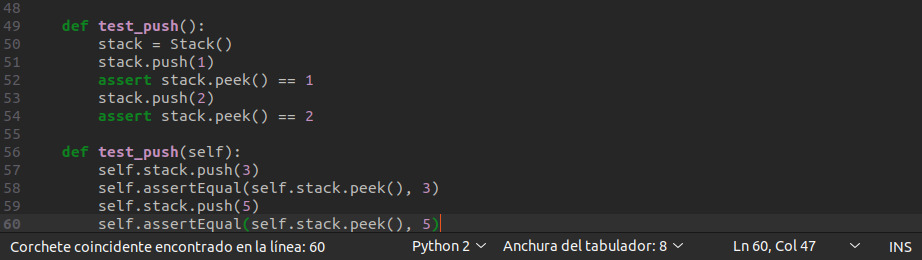

# ACTIVIDAD 11

## Actividad: Escribir aserciones en pruebas con pytest

### Paso 1: Instalación de pytest y pytest-cov

Estando en un entorno virtual, llamado `venv`, instalamos `pytest` y `pytest-cov`. El primero para ejecutar pruebas y el segundo para poder generar informes de cobertura.

### Paso 2: Archivos de prueba

Ejecutando `pytest -v` para probar los tests con más información. También se ejecuta `pytest --exitfirst` para detener la ejecución si un test falla, lo cual no se pudo apreciar ya que todos los tests pasaron.

### Paso 3: Escribiendo aserciones para el método `is_empty()`

- Función `test_is_empty()`:
Esta función prueba el comportamiento del método `is_empty()` de una pila (`Stack`).
	1.  Crea una pila vacía.    
	2.  Verifica que la pila esté vacía justo después de ser creada (`True`).    
	3.  Agrega un elemento (el número 5) a la pila.    
	4.  Verifica que la pila ya no esté vacía (`False`).

- Función `test_pop(self)`:
Esta función prueba el comportamiento del método `pop()` y `peek()`.
	1.  Agrega los valores 3 y luego 5 a la pila.    
	2.  Verifica que al hacer `pop()` se obtenga 5, ya que fue el último elemento agregado.    
	3.  Verifica que el valor visible con `peek()` ahora sea 3, que es la nueva cima.    
	4.  Vuelve a hacer `pop()` para quitar el 3.    
	5.  Verifica que la pila esté vacía.

### Paso 4: Ejecuta pytest para verificar `is_empty()`

Se ejecuta `pytest -v` para probar los nuevos cambios. Todos los tests pasan correctamente.

### Paso 5: Escribiendo aserciones para el método `peek()`

-   Función `test_peek()`:  
Esta función prueba el comportamiento del método `peek()` de una pila usando aserciones simples (estilo `assert`).   
    1.  Crea una pila vacía.        
    2.  Agrega los valores 1 y luego 2 a la pila.        
    3.  Verifica que `peek()` devuelva 2, el último elemento agregado.        
    4.  Verifica nuevamente que `peek()` siga devolviendo 2.

-   Función `test_peek(self)`:
Esta función también prueba el método `peek()` usando `unittest` (`self.assertEqual`).    
    1.  Agrega los valores 3 y luego 5 a la pila.        
    2.  Verifica que `peek()` devuelva 5, valor en la cima de la pila.

### Paso 6: Escribiendo aserciones para el `método pop()`

-   Función `test_pop()`:
Esta función prueba el comportamiento del método `pop()` y `peek()` de una pila usando `assert`.
    1.  Crea una pila vacía.        
    2.  Agrega los valores 1 y luego 2 a la pila.        
    3.  Verifica que `pop()` devuelva 2, ya que es el elemento en la cima y debe ser eliminado.        
    4.  Verifica que `peek()` devuelva 1, ya que es la nueva cima.

-   Función `test_pop(self)`:
Esta función también prueba los métodos `pop()`, `peek()` e `is_empty()`, pero usando `unittest`.    
    1.  Agrega los valores 3 y luego 5 a la pila.        
    2.  Verifica que `pop()` devuelva 5, el valor en la cima.        
    3.  Verifica que `peek()` devuelva 3, el nuevo valor en la cima.        
    4.  Vuelve a hacer `pop()` para quitar el 3.        
    5.  Verifica que la pila esté vacía.

### Paso 7: Escribiendo aserciones para el `método push()`

-   Función `test_push()`:
Esta función prueba el comportamiento del método `push()` y `peek()` de una pila usando `assert`.    
    1.  Crea una pila vacía.        
    2.  Agrega el valor 1 a la pila.        
    3.  Verifica que `peek()` devuelva 1, ya que es el único valor agregado.        
    4.  Agrega el valor 2 a la pila.        
    5.  Verifica que `peek()` devuelva 2, que ahora es la nueva cima.

-   Función `test_push(self)`:
Esta función también prueba el método `push()`, pero usando `unittest`.    
    1.  Agrega el valor 3 a la pila.        
    2.  Verifica que `peek()` devuelva 3.        
    3.  Agrega el valor 5 a la pila.        
    4.  Verifica que `peek()` devuelva 5, que ahora es el nuevo valor de la cima.

### Paso 8: Ejecuta pytest para verificar todas las pruebas

Se ejecuta `pytest -v` para probar los nuevos cambios que se hicieron en los pasos anteriores. Todos los tests pasan correctamente.

### Paso 9: Agregando cobertura de pruebas con pytest-cov

Se ejecuta el comando `pytest --cov=stack --cov-report term-missing` para asegurarnos que los tests cubren suficientes partes del código. En nuestro caso, se obtuvo 100% de cobertura, lo cual indica que todo el código está siendo probado, asegurando un buen comportamiento del mismo.
