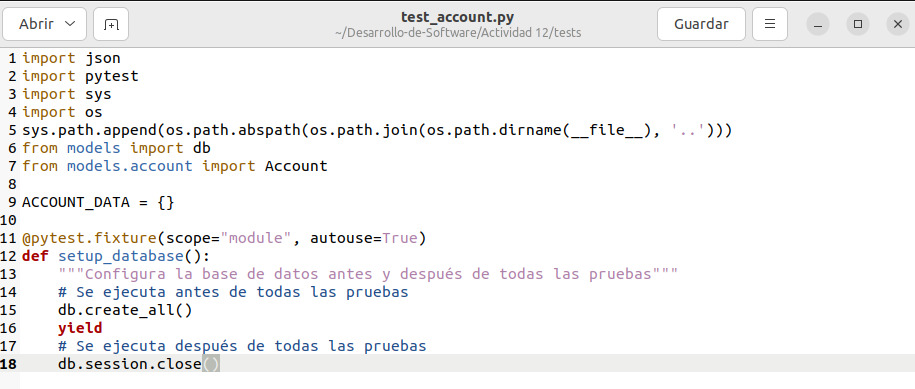
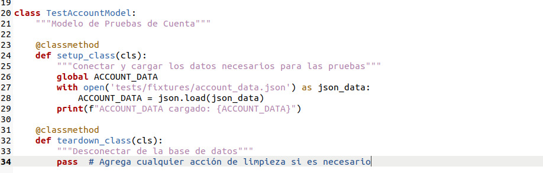
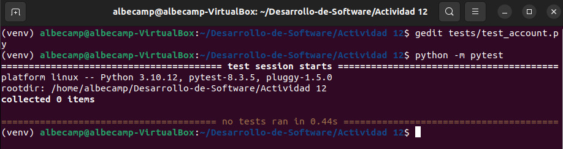
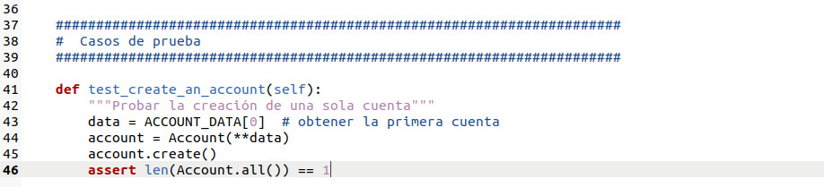
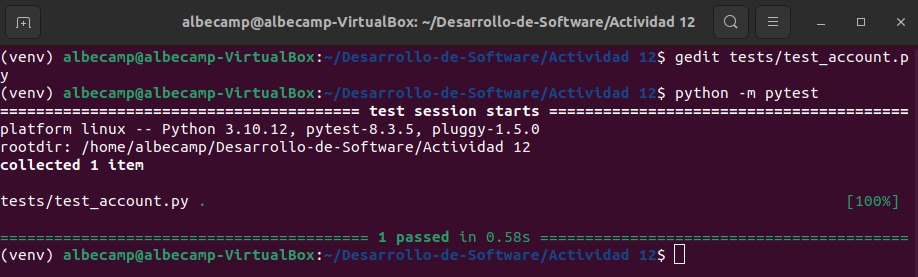
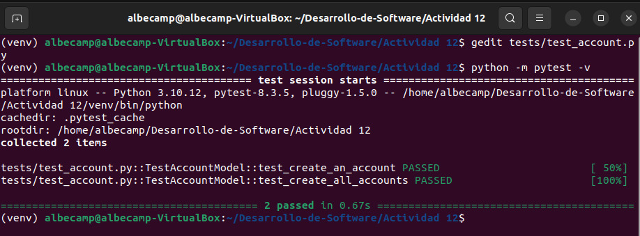
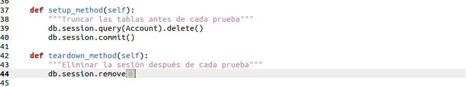
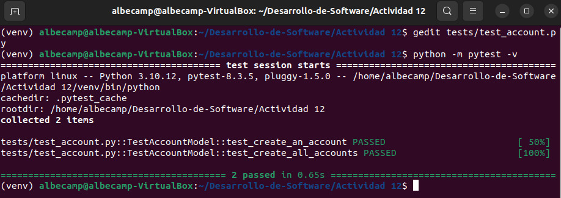

# ACTIVIDAD 12

## Actividad: Revisión de fixtures en pruebas

### Paso 1: Inicializar la base de datos

- Función `setup_database()`:
Esta función es una _fixture_ de `pytest` que configura y limpia la base de datos antes y después de realizar todas las pruebas del módulo.
	1.  Antes de ejecutar cualquier prueba, crea todas las tablas de la base de datos usando `db.create_all()`.    
	2.  Pausa la ejecución con `yield` para que las pruebas se ejecuten después crear la base de datos.    
	3.  Una vez culminadas todos los tests del módulo, cierra la sesión de la base de datos con `db.session.close()`.

#### Pytest

No se muestra nada ya que aún no se implementan las pruebas.

### Paso 2: Cargar datos de prueba

-   `class TestAccountModel`: Define una clase de prueba para el modelo de cuenta. Generalmente usada en tests automatizados.
-   `@classmethod`: Indica que el método siguiente es de clase, no de instancia.
-   `def setup_class(cls)`: Método que se ejecuta una vez antes de todas las pruebas. Sirve para preparar el entorno de pruebas.    
-   `with open('tests/fixtures/account_data.json') as json_data`: Abre el archivo JSON con los datos de prueba. Se usa un bloque `with` para asegurar que se cierre automáticamente.
-   `ACCOUNT_DATA = json.load(json_data)`: Carga el contenido del archivo JSON y lo guarda como un diccionario en `ACCOUNT_DATA`.
-   `def teardown_class(cls)`: Método que se ejecuta una vez al final de todas las pruebas. Esto sirve para limpiar recursos si es que se necesita.

#### Pytest

No se muestra nada ya que aún no se implementan las pruebas.

### Paso 3: Escribir un caso de prueba para crear una cuenta

- Función `test_create_an_account(self)`:
Esta función prueba el proceso de creación de una cuenta utilizando datos de prueba.
	1.  Obtiene un diccionario de datos, desde `ACCOUNT_DATA[0]`, que representan una cuenta de prueba.    
	2.  Crea una instancia de `Account` utilizando esos datos.    
	3.  Llama al método `create()` para guardar la cuenta en la base de datos.    
	4.  Verifica que la lista de todas las cuentas (`Account.all()`) contenga exactamente una cuenta, lo cual nos indica que la creación fue exitosa.

#### Pytest

Los tests pasan correctamente.

### Paso 4: Escribir un caso de prueba para crear todas las cuentas

- Función `test_create_all_accounts(self)`:
Esta función se usa para probar la creación de varias cuentas usando una lista de datos de prueba.
	1.  Recorre todos los diccionarios en `ACCOUNT_DATA`, donde cada uno representa una cuenta.    
	2.  Para cada conjunto de datos se crea una instancia de `Account` y se guarda en la base de datos llamando a `create()`.    
	3.  Al acabar se verifica que el número total de cuentas almacenadas (`Account.all()`) sea igual al número de elementos en `ACCOUNT_DATA`, asegurándonos que todas las cuentas fueron creadas correctamente.

#### Pytest

Los tests pasan correctamente.

### Paso 5: Limpiar las tablas antes y después de cada prueba

-   Función `setup_method(self)`:
Esta función se ejecuta antes de cada test individual para asegurarnos de tener un entorno limpio.    
    1.  Elimina todas las filas de la tabla `Account` usando `db.session.query(Account).delete()`.        
    2.  Aplica los cambios en la base de datos con `db.session.commit()`, asegurando que cada prueba comience con la tabla vacía.
        
-   Función `teardown_method(self)`:
Esta función se ejecuta después de cada test individual para limpiar la sesión de la base de datos.    
    1.  Llama a `db.session.remove()` para cerrar y eliminar la sesión actual, esto con el fin de evitar conflictos.

#### Pytest

Los tests pasan correctamente.
