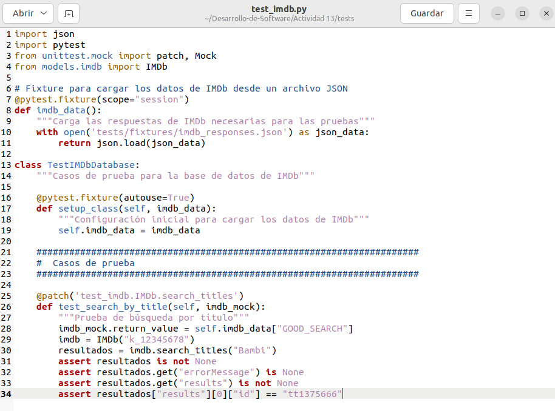
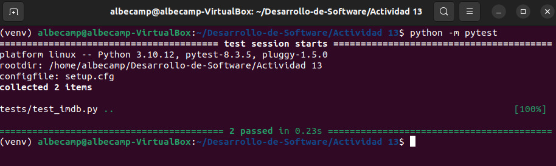

# ACTIVIDAD 13

## Actividad: Objetos mocking

### Paso 1: Probar búsqueda por título

-   `@patch('test_imdb.IMDb.search_titles')`: Es un decorador que mockea el método `search_titles` de la clase IMDb durante la prueba    
-   `def test_search_by_title()`: Se define la función de prueba para realizar búsqueda por título
-   `imdb = IMDb("k_12345678")`: Se crea una instancia de la clase IMDb con una clave API ficticia    
-   `resultados = imdb.search_titles("Bambi")`: Llama al método search_titles con el nombre "Bambi"    
-   `assert resultados is not None`: Verifica que se obtuvo algún resultado  
-   `assert resultados.get("errorMessage") is None`: Para comprobar que no hay mensajes de error en la respuesta    
-   `assert resultados.get("results") is not None`: Verifica que existe "results" en la respuesta    
-   `assert resultados["results"][0]["id"] == "tt1375666"`: Para comprobar que el primer resultado tiene el ID esperado

#### Pytest

### Paso 2: Búsqueda sin resultados

-   `@patch('models.imdb.requests.get')`: Decorador que mockea la función `requests.get` del módulo `models.imdb`    
-   `def test_search_with_no_results(self, imdb_mock)`: Se define el método de prueba que recibe el mock como parámetro, `imdb_mock`     
-   `imdb_mock.return_value = Mock(status_code=404)`: Se configura el mock para devolver un objeto mock simulando una respuesta HTTP con error 404 (no encontrado)    
-   `imdb = IMDb("k_12345678")`: Se crea una instancia de la clase IMDb con una clave API ficticia    
-   `resultados = imdb.search_titles("Titulo inexistente")`: Se llama al método con un título que no debería existir    
-   `assert resultados == {}`: Se verifica que la respuesta es un diccionario vacío, siendo el comportamiento esperado cuando no hay resultados

#### Pytest

### Paso 3: Búsqueda por título fallida

-   `@patch('models.imdb.requests.get')`: Decorador para mockear `requests.get` en el módulo models.imdb    
-   `def test_search_by_title_failed(imdb_mock)`: Función de prueba que recibe el mock como parámetro
-   `imdb_mock.return_value = Mock(`: Para configurar el valor de retorno del mock    
	-   `spec=Response,`: Se especifica que el mock debe imitar un Response de requests    
	-   `status_code=200,`: Simula un código de estado HTTP 200 (exito)    
	-   `json=Mock(return_value=IMDB_DATA["INVALID_API"])`: Para configurar el método json() para devolver datos de error    
-   `imdb = IMDb("bad-key")`: Se crea instancia de IMDb con clave API inválida    
-   `resultados = imdb.search_titles("Bambi")`: Se ejecuta la búsqueda con un título válido    
-   `assert resultados is not None`: Verifica que hubo respuesta, aunque sea un error
-   `assert resultados["errorMessage"] == "Invalid API Key"`: Se comprueba el mensaje de error

#### Pytest

### Paso 4: Probar calificaciones de películas

-   `@patch('models.imdb.requests.get')`: Decorador que mockea la función `requests.get` en el módulo models.imdb    
-   `def test_movie_ratings(imdb_mock):`: Se define la función de prueba que recibe el mock como parámetro     
-   `imdb_mock.return_value = Mock(`: Se configura el valor de retorno del mock    
	-   `spec=Response,`: Indica que el mock debe imitar un Response    
	-   `status_code=200,`: Simula un código HTTP 200 (éxito)    
	-   `json=Mock(return_value=IMDB_DATA["GOOD_RATING"])`: Se configura el método json() para devolver datos de prueba    
-   `imdb = IMDb("k_12345678")`: Se crea instancia de IMDb con clave API válida    
-   `resultados = imdb.movie_ratings("tt1375666")`: Llama al método con un ID de película válido    
-   `assert resultados is not None`: Verifica que se obtuvo respuesta    
-   `assert resultados["title"] == "Bambi"`: Verifica que el título es correcto    
-   `assert resultados["filmAffinity"] == 3`: Compara la calificación de FilmAffinity    
-   `assert resultados["rottenTomatoes"] == 5`: Compara la calificación de Rotten Tomatoes

#### Pytest

