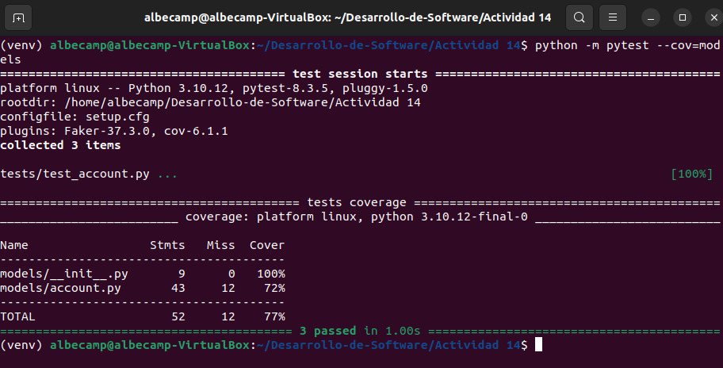

# ACTIVIDAD 14

## Factory y fakes

### Paso 1: Ejecutar pytest

Luego de agregar los archivos iniciales, ejecutamos `pytest --cov=models`:

### Paso 2: Crear una clase `AccountFactory`

-   `class AccountFactory(factory.Factory)` Se define una factory para crear cuentas falsas
-   `class Meta:` Es una clase interna para configuración    
	-   `model = Account`: Se especifica el modelo de datos a generar    
-   `id = factory.Sequence(lambda n: n)`: Genera IDs que se incrementan    
-   `name = factory.Faker("name")`: Se crea nombres aleatorios  
-   `email = factory.Faker("email")` 	Se genera emails válidos aleatorios    
-   `phone_number = factory.Faker("phone_number")`: Se genera números telefónicos falsos    
-   `disabled = FuzzyChoice(choices=[True, False])`: Asigna aleatoriamente true/false    
-   `date_joined = FuzzyDate(date(2008, 1, 1))`: Se genera fechas aleatorias desde 2008

### Paso 3: Actualizar los casos de prueba

- `def test_crear_todas_las_cuentas(self):` Se define el método de prueba para creación múltiple de cuentas  
- `for _ in range(10):` Para iterar 10 veces para crear cuentas  
- `account = AccountFactory()`: Usa factory para generar una cuenta falsa  
- `account.create()`: Cuenta generada  
- `assert len(Account.all()) == 10` Verificar que existan exactamente 10 cuentas creadas

#### Pytest --cov=models

### Paso 4: Actualizar `test_crear_una_cuenta()`

-   `def test_crear_una_cuenta(self):` Se define el método de prueba para creación de una cuenta    
-   `account = AccountFactory()`: Se genera una instancia de cuenta usando factory    
-   `account.create()`: Cuenta en la base de datos    
-   `assert len(Account.all()) == 1`: Verificar que una cuenta fue creada y almacenada

#### Pytest --cov=models

### Paso 5: Actualizar `test_to_dict()`

-   `def test_to_dict(self):` Se prueba la serialización de cuenta a diccionario    
-   `account = AccountFactory()` Se crea cuenta de prueba con datos falsos    
-   `result = account.to_dict()` Se convierte la cuenta a diccionario    
-   `assert account.name == result["name"]` Se verifica nombre en diccionario    
-   `assert account.email == result["email"]` Se comprueba email en diccionario    
-   `assert account.phone_number == result["phone_number"]` Se valida teléfono en diccionario    
-   `assert account.disabled == result["disabled"]` Se confirma estado disabled
-   `assert account.date_joined == result["date_joined"]` Se asegura fecha correcta

#### Pytest --cov=models

### Paso 6: Actualizar `test_from_dict()`

- `def test_from_dict(self):` Se prueba la deserialización desde diccionario  
- `data = AccountFactory().to_dict()`: Se genera datos falsos en formato diccionario  
- `account = Account()`: Se crea una instancia vacía de Account  
- `account.from_dict(data)`: Cargar los datos del diccionario al objeto  
- `assert account.name == data["name"]`: Verifica nombre cargado correctamente  
- `assert account.email == data["email"]`: Comprueba email cargado  
- `assert account.phone_number == data["phone_number"]`: Valida teléfono cargado  
- `assert account.disabled == data["disabled"]`: Confirma estado disabled 

#### Pytest --cov=models

### Paso 7: Actualizar `test_actualizar_una_cuenta()`

- `def test_actualizar_una_cuenta(self):` Probar la actualización de una cuenta  
- `account = AccountFactory()`: Se crea una cuenta de prueba  
- `account.create()`: Cuenta en la base de datos  
- `assert account.id is not None`: Se verifica que la cuenta tenga ID asignado  
- `account.name = "Rumpelstiltskin"`: Modifica el nombre de la cuenta  
- `account.update()`: Actualiza la cuenta en la base de datos  
- `found = Account.find(account.id)`: Busca la cuenta actualizada  
- `assert found.name == account.name`: Confirma que el cambio se mantuvo correctamente

#### Pytest --cov=models

### Paso 8: Actualizar `test_id_invalido_al_actualizar()`

- `def test_id_invalido_al_actualizar(self):` Probar actualización con ID inválido  
- `account = AccountFactory()`: Se crea una cuenta de prueba  
- `account.id = None`: Se establece una ID inválida (none)  
- `with pytest.raises(DataValidationError):` Verifica que lance excepción  
- `account.update()`: Intenta actualizar la cuenta sin ID válido

#### Pytest --cov=models

### Paso 9: Actualizar `test_eliminar_una_cuenta()`

- `def test_eliminar_una_cuenta(self):` Probar la eliminación de una cuenta  
- `account = AccountFactory()`: Se crea una cuenta de prueba  
- `account.create()`: Cuenta en la base de datos  
- `assert len(Account.all()) == 1`: Se verifica que existe 1 cuenta antes de eliminar  
- `account.delete()`: Se elimina la cuenta de la base de datos  
- `assert len(Account.all()) == 0`: Confirmar que la cuenta fue eliminada correctamente

#### Pytest --cov=models

