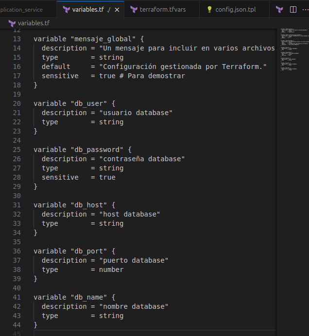
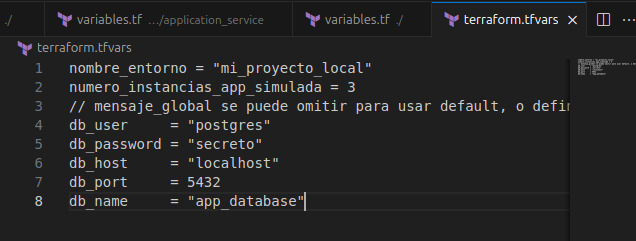
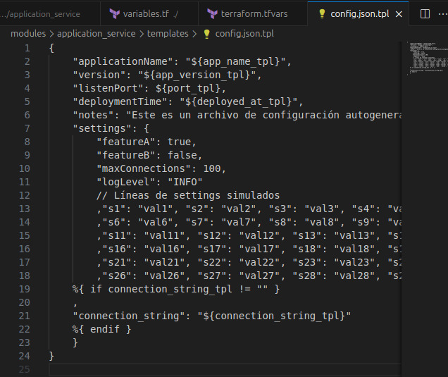
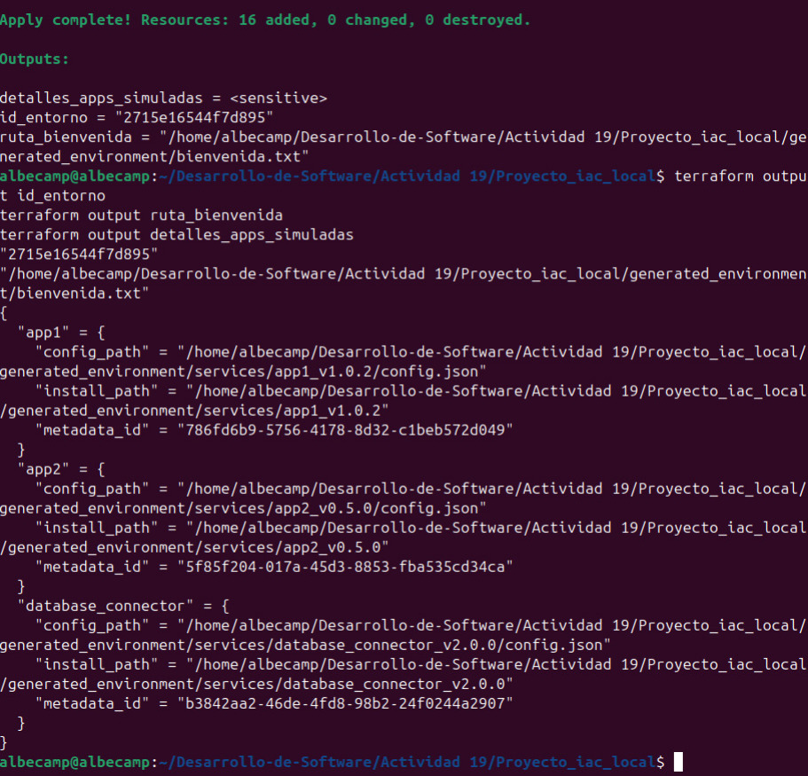

# ACTIVIDAD 19

## Fases

### Fase 0: Preparación e introducción
1.  **¿Qué es infraestructura?**
      * Explica que, en este contexto local, la "infraestructura" serán directorios, archivos de configuración, scripts y la estructura lógica que los conecta.
Cuando hablamos de infraestructura en el contexto local, entonces no nos referimos a servidores ni nubes, sino a una simulación de la infraestructura que está compuesta por directorios, archivos de configuración, scripts para simulación y una estructura lógica y parametrizada. Al usar terraform, estamos orquestando la estructura local para simular que estamos desplegando recursos realess, aunque en realidad solamente estemos creando archivos y carpetas organizados aplicando las características de IaC, como por ejemplo la reproducibilidad.
      * Compara con infraestructura tradicional (servidores físicos, redes) y cloud (VMs, VPCs)

### Fase 1: Fundamentos de terraform y primer recurso local

* **Concepto:** Creación básica de recursos.
  * **Archivos a crear/modificar:**
      * `versions.tf`:
        ```terraform
        terraform {
          required_version = ">= 1.0"
          required_providers {
            local = {
              source  = "hashicorp/local"
              version = "~> 2.5"
            }
            random = {
              source  = "hashicorp/random"
              version = "~> 3.6"
            }
          }
        }
        ```
      * `main.tf`:
        ```terraform
        resource "local_file" "bienvenida" {
          content  = "Bienvenido al proyecto IaC local! Hora: ${timestamp()}"
          filename = "${path.cwd}/generated_environment/bienvenida.txt"
        }

        resource "random_id" "entorno_id" {
          byte_length = 8
        }

        output "id_entorno" {
          value = random_id.entorno_id.hex
        }

        output "ruta_bienvenida" {
          value = local_file.bienvenida.filename
        }
        ```

**`versions.tf`**: Archivo donde se define la versión requerida de terraform y providers que usará
- `required_version`: Verifica que estemos usando una versión mínima de terraform, en este caso 1.0
- `required_providers`: Para indicar los proveedores requeridos
	- `local`: Para crear y gestionar recursos en la estructura de los archivos locales, por ejemplo archivos txt
	- `random`: Para generar valores aleatorios.

**`main.tf`**: Donde se define los recursos reales que se crearán y los outputs de terraform luego de aplicar los cambios
-   `resource "local_file" "bienvenida"`:  Primero crea un archivo llamado `bienvenida.txt`, luego se agrega un mensaje al archivo, incluyendo la hora actual usando `timestamp()` y por último se define la ubicación en el directorio dentro del proyecto usando la ruta `path.cwd`
-   `resource "random_id" "entorno_id"`: Generación de un ID aleatorio con longitud de 8 bytes.
-   `output "id_entorno"`: Es un output que aparecerá al aplicar Terraform, se le asigna como valor el id en forma hexadecimal generado por el recurso anterior.
-   `output "ruta_bienvenida"`: Otro output, su valor será la ruta del archivo `bienvenida.txt` y permite al usuario saber dónde encontrar el archivo en el local.

## Ejercicios

### Ejercicio 1
1.  **Ejercicio de evolvabilidad y resolución de problemas:**

      * **Tarea:** Añade un nuevo "servicio" llamado `database_connector` al `local.common_app_config` en `main.tf`. Este servicio requiere un parámetro adicional en su configuración JSON llamado `connection_string`.
      * **Pasos:**
        1.  Modifica `main.tf` para incluir `database_connector`.
        2.  Modifica el módulo `application_service`:
              * Añade una nueva variable `connection_string_tpl` (opcional, por defecto un string vacío).
              * Actualiza `config.json.tpl` para incluir este nuevo campo.
              * Haz que el `connection_string` solo se incluya si la variable no está vacía (usar condicionales en la plantilla o en `locals` del módulo).
        3.  Actualiza el script `validate_config.py` para que verifique la presencia y formato básico de `connection_string` SOLO para el servicio `database_connector`.
     



Es necesario declarar las variables que se usarán dentro del módulo principal, entonces se añaden variables como `db_user`, `db_password`, `db_host`, etc. Estas se usarán para definir los parámetros de conexión al database. Es importante su definición para que terraform trabaje correctamente con el archivo `main.tf`




Se definen los valores de las variables en el archivo `terraform.tfvars` para asegurarnos una buena parametrización. Se asignan concretamente para cada variable utilizada por terraform, por lo que nos permite separar la lógica de los valores específicos del entorno y facilitandonos la reutilización del código sin alterar los archivos .tf principales





