# ACTIVIDAD 4 - EJERCICIOS
## Ejercicio 1: Manejo avanzado de ramas y resolución de conflictos
Este ejercicio nos ayudará a comprender mejor las diversas acciones que se pueden hacer con las ramas, como lo son la unión, la creación o eliminación de estas. Sabemos que durante el desarrollo de un proyecto pueden ocurrir conflictos, entonces este ejercicio nos muestra claramente cómo se pueden solucionarlos.
### 1. Crear una rama para una característica:
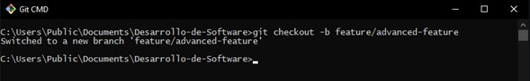

### 2. Modificar archivos en la nueva rama:
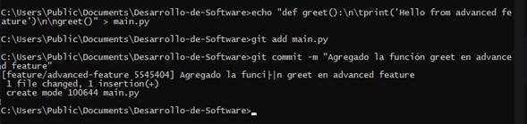

### 3. Simular un desarrollo paralelo en la rama main:
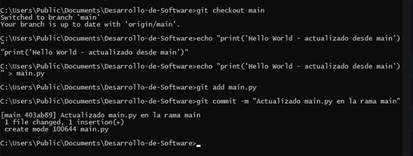

### 4. Intentar fusionar la rama feature/advanced-feature en main:
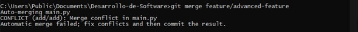

### 5. Resolver el conflicto de fusión:
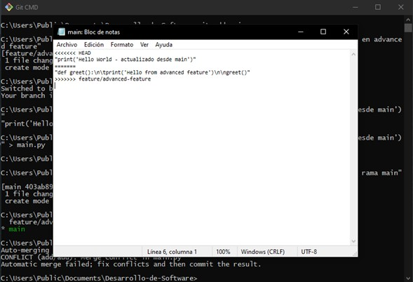
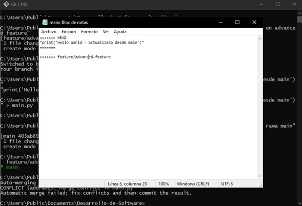
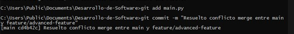

### 6. Eliminar la rama fusionada:
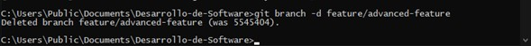

## Ejercicio 2: Exploración y manipulación del historial de commits
Este ejercicio nos permite explorar los commits y su historial, además de cómo "jugar" con estos mediante comandos. Es un ejercicio importante ya que la revisión de commits anteriores y gestionarlos es fundamental para saber como se está desarrollando el proyecto.
### 1. Ver el historial detallado de commits:
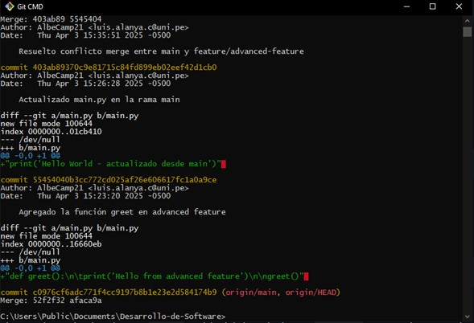

**Examina las diferencias introducidas en cada commit. ¿Qué cambios fueron realizados en cada uno?**

En la imagen podemos ver algunos commits que se hizo en el repositorio, los últimos commits fueron hechos en el ejercicio anterior. En la imagen podemos notar como cada commit tiene un hash diferente, además nos muestra el autor que los realizó (mi persona), la fecha y el mensaje que se pone en cada commit para indicar que se hizo.

### 2. Filtrar commits por autor:
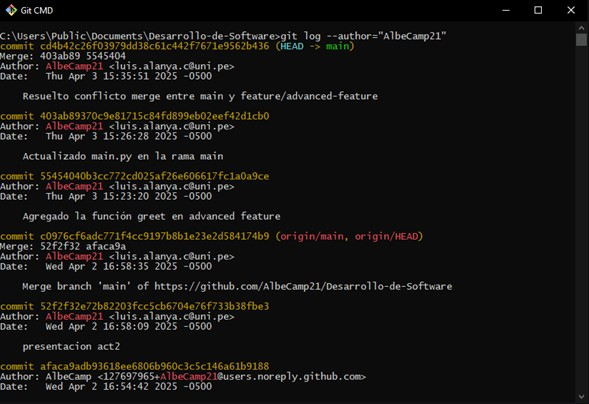

### 3. Revertir un commit:
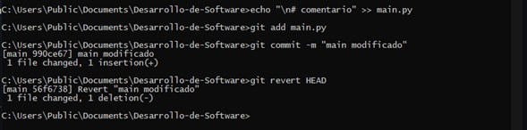
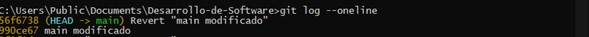

### 4. Rebase interactivo:
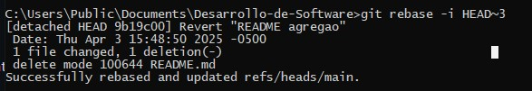

### 5. Visualización gráfica del historial:
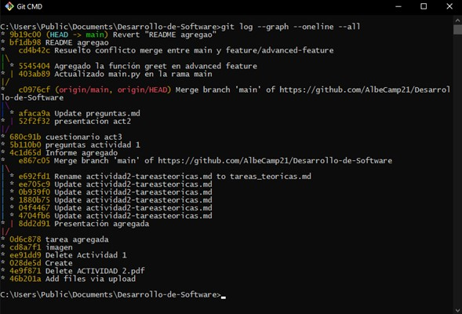

**Reflexiona sobre cómo el historial de tu proyecto se visualiza en este formato. ¿Qué información adicional puedes inferir?**

Debido a que se uso la opción --graph, podemos ver la lista de commits de una forma más agradable, organizada. Se observa los primeros commits que se hizo de otras actividades, también una rama distinta a main, que es advanced-feature.
Se ven varias actividade que se hicieron en el proyecto, por ejemplo actualizaciones, creaciones o eliminaciones de archivo. Por último vemos un merge, lo cual indica que hubo una unión entre dos branchs

## Ejercicio 3: Creación y gestión de ramas desde commits específicos
En este ejercicio aprenderemos a cómo crear ramas desde commits ya hechos. Esto nos ayudará a entender como funcionan las referencias en Git y a tener un mayor control en las versiones del código en nuestros proyectos a lo largo del desarrollo.
### 1. Crear una nueva rama desde un commit específico:
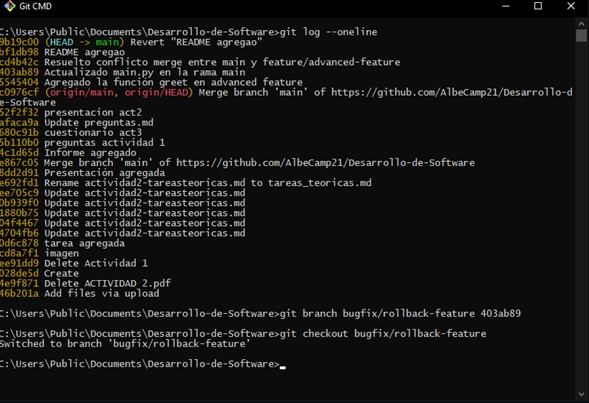

### 2. Modificar y confirmar cambios en la nueva rama:
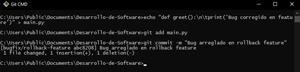

### 3. Fusionar los cambios en la rama principal:
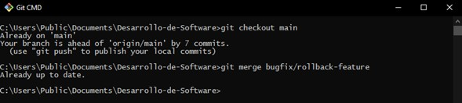

### 4. Explorar el historial después de la fusión:
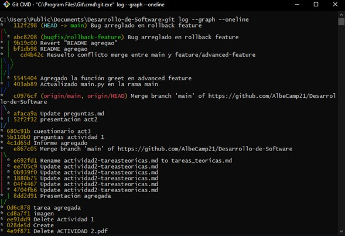

### 5. Eliminar la rama bugfix/rollback-feature:
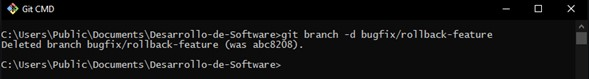

## Ejercicio 4: Manipulación y restauración de commits con git reset y git restore
Este ejercicio es importante ya que comprenderemos lo importante que es deshacer cambios en nuestro proyecto. Conoceremos comandos poderosos como `git reset` o `git restore`, que nos ayudarán a corregir errores sin afectar el flujo de trabajo.
### 1. Hacer cambios en el archivo main.py:
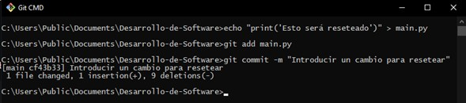

### 2. Usar git reset para deshacer el commit:
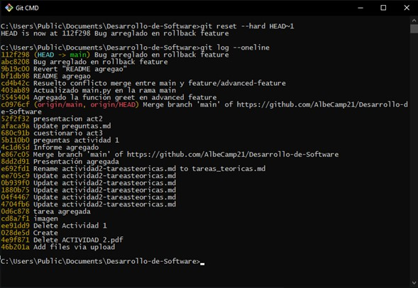
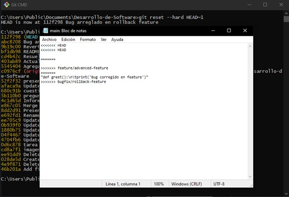

### 3. Usar git restore para deshacer cambios no confirmados:
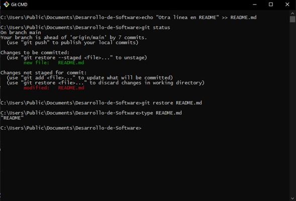

## Ejercicio 5: Trabajo colaborativo y manejo de Pull Requests
Ejercicio importante ya que simularemos como si estuviéramos en una organización, viendo la colaboración en los flujos de trabajo con los branchs. Acá veremos el pull request, que son solicitudes para fusionar cambios con el branch principal.
### 1. Crear un nuevo repositorio remoto:
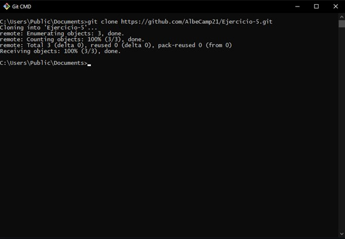

### 2. Crear una nueva rama para desarrollo de una característica:
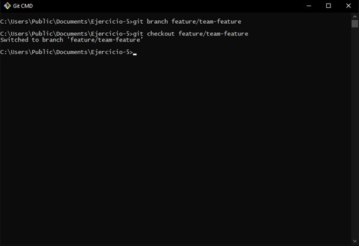

### 3. Realizar cambios y enviar la rama al repositorio remoto:
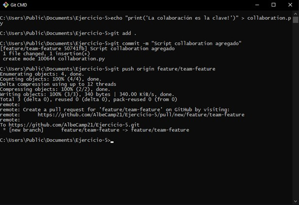

### 4. Abrir un Pull Request:
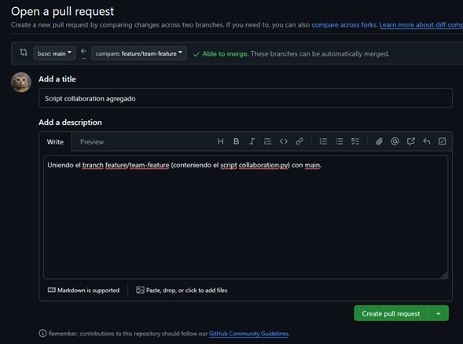

### 5. Revisar y fusionar el Pull Request:
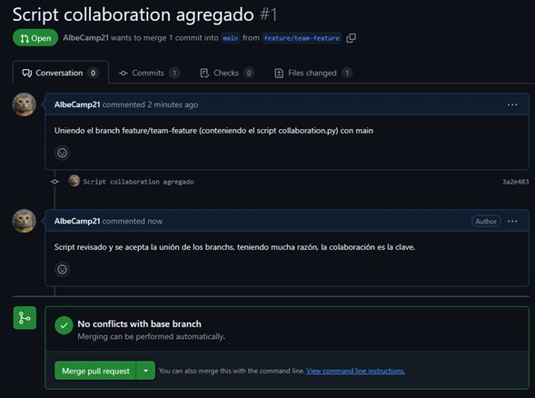
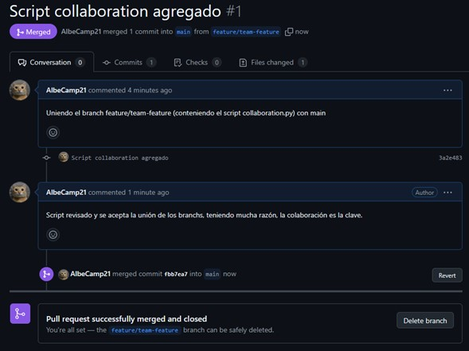

### 6. Eliminar la rama remota y local:
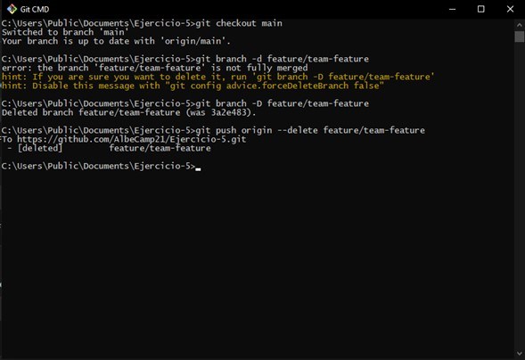

## Ejercicio 6: Cherry-Picking y Git Stash
En este último ejercicio aprenderemos sobre `git cherry-pick` y cómo podemos almacenar cambios no confirmados de manera temporal.
### 1. Hacer cambios en main.py y confirmarlos:
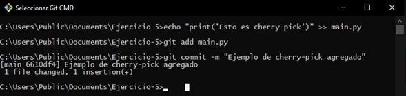

### 2. Crear una nueva rama y aplicar el commit específico:
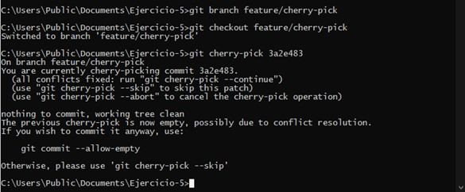

### 3. Guardar temporalmente cambios no confirmados:
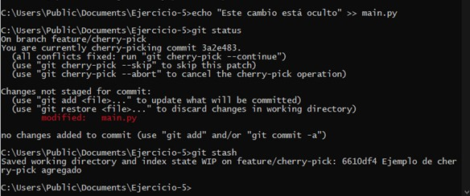

### 4. Aplicar los cambios guardados:
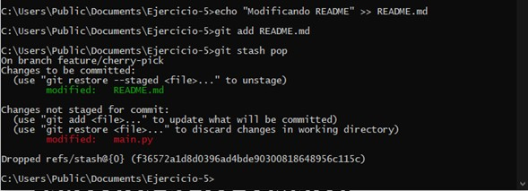

### 5. Revisar el historial y confirmar la correcta aplicación de los cambios:
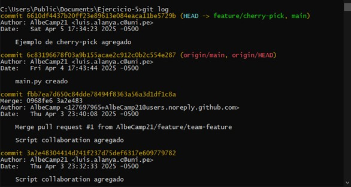
