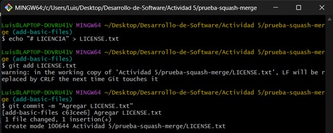
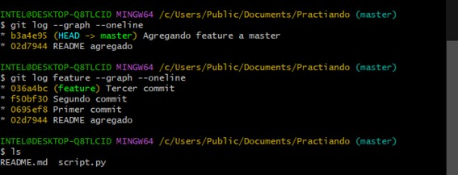
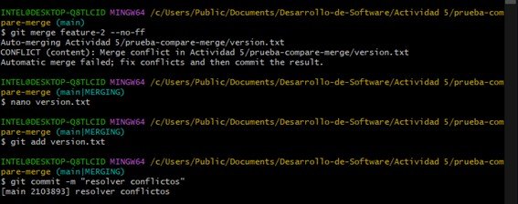

# ACTIVIDAD 5 - CASOS Y EJERCICIOS
## Caso 1: Fusión Fast-forward
Aplicando los comandos en la actividad:

**Pregunta:** Muestra la estructura de commits resultante.

**Resultado:** Ahora, veamos la lista de commits después de aplicar merge:

## Caso 2: Fusión No-fast-forward
Aplicando los comandos en la actividad:

**Pregunta:** Muestra el log de commits resultante.

**Resultado:** Después de la edición, veamos el log ahora:

## Caso 3: Fusión squash
Aplicando los comandos en la actividad:

**Pregunta:** ¿Cuál es tu estructura de commits?.

**Resultado:** Luego de hacer la fusión squash, obtenemos:

## Ejercicio 1: Clona un repositorio Git con múltiples ramas
Identifica dos ramas que puedas fusionar utilizando `git merge --ff`.

Haz el proceso de fusión utilizando `git merge --ff`.

Verifica el historial con `git log --graph --oneline`

**Pregunta:** ¿En qué situaciones recomendarías evitar el uso de `git merge --ff`? Reflexiona sobre las desventajas de este método.

El uso de `git merge --ff` recomiendo evitar cuando se quiere mantener un historial claro, sobretodo cuando se trabajo en equipos. Este tipo de merge no genera un commit de combinación, entonces puede hacer que el historial de commits sea confusa al no quedar registrado la fusión de ramas. Ademá, se hace más complicado cuando se quiere revertir cambios de un branch completo.

## Ejercicio 2: Simula un flujo de trabajo de equipo
Trabaja en dos ramas independientes, creando diferentes cambios en cada una.

Fusiona ambas ramas con `git merge --no-ff` para ver cómo se crean los commits de fusión.

Observa el historial utilizando `git logo --graph --oneline`

**Pregunta:** ¿Cuáles son la principales ventajas de utilizar `git merge --no-ff` en un proyecto en equipo? ¿Qué problemas podrían surgir al depender excesivamente de commits de fusión?

Usar este tipo de merge en un proyecto en equipo nos da la ventaja de mantener un historial claro, mostrando datos importantes como el momento cuando se integró un branch, haciendo más fácil la revisión o el revertimiento de cambios.
El problema que puede provocar esto es que el historial se puede llenar de merges irrelevantes, volviéndose más complicado de leerlas si se abusa de este tipo.

## Ejercicio 3: Crea múltiples commits en una rama
Haz varios cambios y commits en una rama feature.

Fusiona la rama con `git merge --squash` para aplanar todos los commits en uno solo.

Verifica el historial de commits antes y después de la fusión para ver la diferencia.

**Pregunta:** ¿Cuándo es recomendable utilizar una fusión squash? ¿Qué ventajas ofrece para proyectos grandes en comparación con fusiones estándar?

Se recomienda usar el merge squash cuando se quiere hacer fusiones de una rama con commits pequeños, como por ejemplo commits experimentales, queriendo resumir todo eso en un solo commit. A diferencia de los otros tipos de merge, el squash no ayuda a evitar rellenar el historial con datos innecesarios, facilitando la revisión del proyecto.

## Caso 4: Resolver conflictos en una fusión non-fast-forward
1. Crea un archivo index.html y realiza un commit en la rama main.

2. Crea y cambia a una nueva rama para luego editar el archivo y realizar un commit.

3. Regresa a la rama main y realiza una edición en el mismo archivo.

4. Fusiona la rama feature-update con --no-ff y observa el conflicto.

5. Edita el archivo para eliminar el conflicto y haz commit.

6. Verifica el historial para confirmar la fusión y el commit de resolución de conflicto.

**Preguntas:**
- ¿Qué pasos adicionales tuviste que tomar para resolver el conflicto?
klklklklk
- ¿Qué estrategias podrías emplear para evitar conflictos en futuros desarrollos colaborativos?
jjkljljk

## Ejercicio 4: Comparar los historiales con git log después de diferentes fusiones
1. Crea un nuevo repositorio y realiza varios commits en dos rama.

2. Fusiona feature-1 usando fast-forward.

3. Fusiona feature-2 usando non-fast-forward.

4. Realiza una nueva rama feature-3 con múltiples commits y fusiónala con squash.

5. Compara el historial de Git

**Preguntas:**
- ¿Cómo se ve el historial en cada tipo de fusión?
klklklklk
- ¿Qué método prefieres en diferentes escenarios y por qué?
jjkljljk

## Ejercicio 5: Usando fusiones automáticas y revertir fusiones
1. Inicializa un nuevo repositorio y realiza dos commits en main.

2. Crea una nueva rama auto-merge y realiza otro commit en file.txt.

3. Vuelve a main y realiza cambios no conflictivos en otra parte del archivo.

4. Fusiona la rama auto-merge con main.

5. Revertir la fusión: Si decides que la fusión fue un error, puedes revertirla. Luego, verifica el historial.

**Preguntas:**
- ¿Cuándo usarías un comando como git revert para deshacer una fusión?
Usaría dicho comando para revertir una fusión de una rama con la principal, revirtiendo esos cambios sin borrarlos del historial. En casos colaborativos es muy útil cuando el merge ya se ha compartido con otras personas.
- ¿Qué tan útil es la función de fusión automática en Git?
Es muy útil ya que resuelve la gran mayoría de conflictos de forma inteligente, su utilidad aumenta en proyectos grandes donde hay muchos colaboradores. Sin embargo, hay casos donde aún se necesitará intervención manual.

## Ejercicio 6: Fusión remota en un repositorio colaborativo
1. Clona un repositorio remoto desde GitHub o crea uno nuevo.

2. Crea una nueva rama de colaboración y haz algunos cambios.

3. Empuja los cambio a la rama remota.

4. Simula una fusión desde la rama colaboración en la rama main de otro colaborador. (Puedes usar la interfaz de GitHub para crear un Pull Request y realizar la fusión).

**Preguntas:**
- ¿Cómo cambia la estrategia de fusión cuando colaboras con otras personas en un repositorio remoto?
Cuando se colabora con otras persona en un repositorio, el uso de Pull Request se vuelve fundamental para revisar y sobretodo discutir los cambios que se hacen. También, al colaborar, se debe mantener un historial ordenado, por lo que una buena idea es usar No-fast-forward o squash.
- ¿Qué problemas comunes pueden surgir al integrar ramas remotas?
Al usar ramas remota pueden aparecer conflictos si varias personas modifican las mismas líneas de código. Otro problema común es que alguien se olvide de hacer push, causando falla en la sincronización.
