# ACTIVIDAD 6: Rebase, Cherry-Pick Y CI/CD
## Parte 1: git rebase para mantener un historial lineal

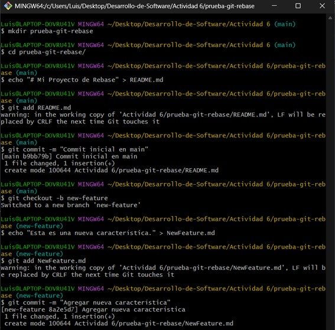

**Pregunta:** Presenta el historial de ramas obtenida hasta el momento.

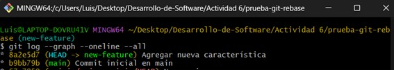

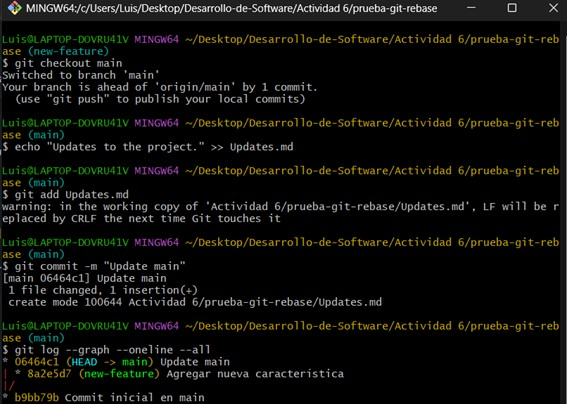

**Tarea:** Realiza el rebase de `new-feature` sobre `main`.

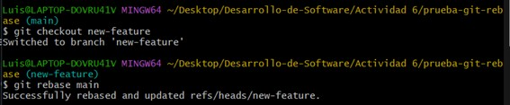

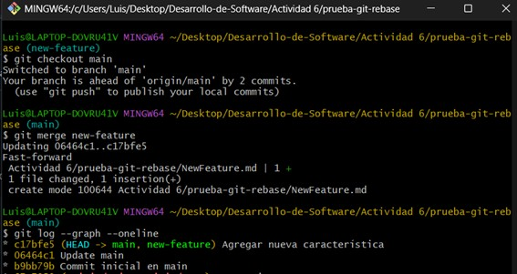

## Parte 2: git cherry-pick para la integración selectiva de commit

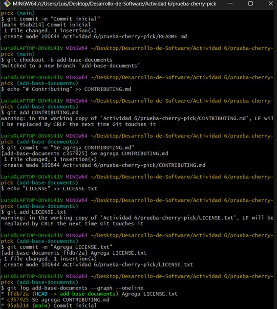

**Tarea:** Haz cherry-pick de un commit de add-base-documents a main.

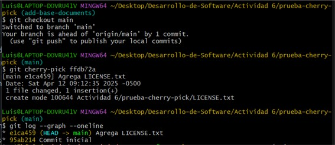

### Preguntas de discusión:
**1. ¿Por qué se considera que rebase es más útil para mantener un historial de proyecto lineal en comparación con merge?**

El rebase nos ayuda a que el historial se vea más ordenado. Rebase no mezcla ramas como merge, sino que reubica los cambios como si se hubieran hecho después del último cambio en la rama main, dando la apariencia de que todo fue hecho en una misma línea de tiempo, o sea, sin otras ramas.

**2. ¿Qué problemas potenciales podrían surgir si haces rebase en una rama compartida con otros miembros del equipo?**

Si se está trabajando en equipo en una misma rama y se hace rebase, podrían aparecer conflictos porque se cambia el historial por otro diferente al que los demás compañeros tienen, si no se comunican estos cambios se pueden originar errores en el proyecto.

**3. ¿En qué se diferencia cherry-pick de merge, y en qué situaciones preferirías uno sobre el otro?**

Cherry-pick nos permite traer commits específicos a otra rama diferente a la que fue creada. En cambio, merge fusiona todos los commits de una rama en otra. Si necesitamos hacer cambios específicos, entonces es mejor usar cherry-pick. Si queremos combinar trabajos entonces debemos usar merge.

**4. ¿Por qué es importante evitar hacer rebase en ramas públicas?**

Porque al aplicar rebase, cambiamos el historial de cambios de la rama. Al ser una rama pública, otros estarían trabajando con el historial pasado, por lo cual tendrían errores o conflictos al momento de aplicar sus cambios. Entonces, se recomienda usar rebase cuando se trabaja individualmente en una rama o proyecto.

### Ejercicios teóricos
**1. Diferencias entre git merge y git rebase**
**Pregunta:** Explica la diferencia entre git merge y git rebase y describe en qué escenarios sería más adecuado utilizar cada uno en un equipo de desarrollo ágil que sigue las prácticas de Scrum.

Ambos comandos son formas para combinar ramas, pero tienen ligeras diferencias. Merge toma todos los commits de una rama A y los añade a una rama B. El rebase, reubica los commits de la rama A al final, después del último commit hecho en la rama B, haciendo un historial más lineal.
En Scrum, si se quiere mantener el contexto del trabajo de equipo entonces es recomendable usar merge. Ahora, se puede usar rebase antes de aplicar un merge (de forma individual), con el fin de limpiar el historial y sea más entendible para el resto del equipo.

**2. Relación entre git rebase y DevOps**
**Pregunta:** ¿Cómo crees que el uso de git rebase ayuda a mejorar las prácticas de DevOps, especialmente en la implementación continua (CI/CD)? Discute los beneficios de mantener un historial lineal en el contexto de una entrega continua de código y la automatización de pipelines.

Al implementar CI/CD, es importante mantener claro el historial de cambios que se hagan para la automatización de las pruebas y entregas. Para este caso, git rebase ayuda ya que mantiene el historial de manera lineal, facilitando la detección de errores de parte de los pipelines automatizados.
Un beneficio de mantener un historial limpio es que se reduce la probabilidad de encontrar conflictos durante las integraciones.

**3. Impacto del git cherry-pick en un equipo Scrum**
**Pregunta:** Un equipo Scrum ha finalizado un sprint, pero durante la integración final a la rama principal (main) descubren que solo algunos commits específicos de la rama de una funcionalidad deben aplicarse a producción. ¿Cómo podría ayudar git cherry-pick en este caso? Explica los beneficios y posibles complicaciones.

Cherry-pick nos permite aplicar commits específicos de una rama A a una rama B, evitándonos fusionar toda la rama con merge. Si estamos en un equipo Scrum, el uso de cherry-pick es fundamental ya que habrá casos donde solamente queramos añadir ciertos commits a una rama.
Sin embargo, también puedes surgir conflictos si los commits usados con cherry-pick dependen de otros que no están siendo elegidos, por eso es recomendable siempre aplicarlo con precaución mirando siempre el historial.

## Ejercicios prácticos
### 1. Simulación de un flujo de trabajo Scrum con git rebase y git merge

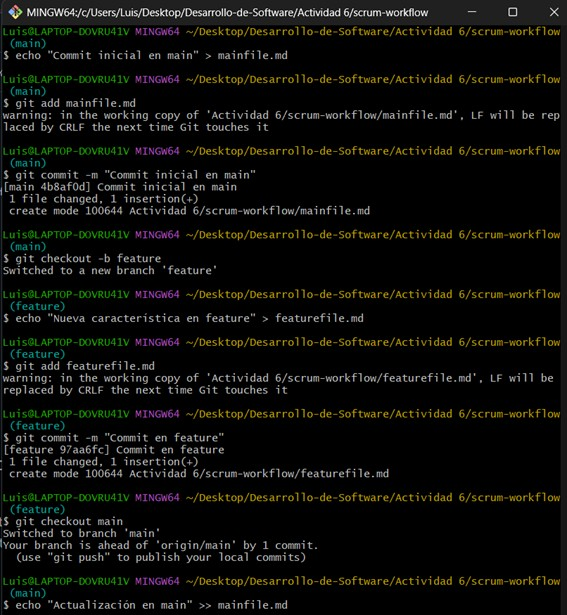

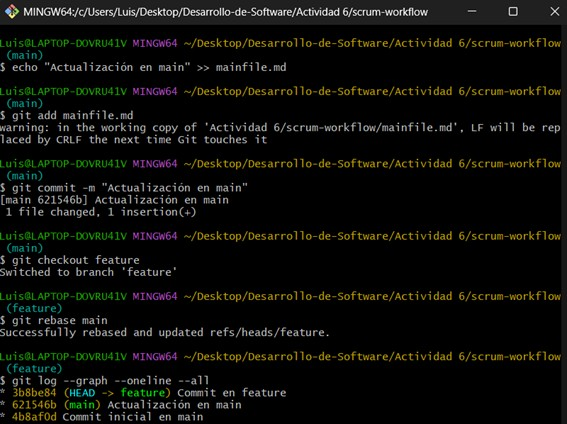

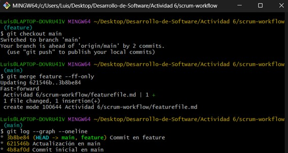

**Preguntas:**
1. ¿Qué sucede con el historial de commits después del rebase?
Después de aplicar rebase, los commits de la rama feature se pasan después del último commit hecho en la rama main, como si se hubieran hecho después de este último commit.

2. ¿En qué situación aplicarías una fusión fast-forward en un proyecto ágil?
El merge fast-forward se puede aplicar cuando no se han hechos cambios en la rama main luego de crearse la rama feature. Si se aplica, se mueve el puntero de la rama main hacia el último cambio. Se puede usar después de aplicar rebase para que la fusión sea más directa y sin conflictos.

### 2. Cherry-pick para integración selectiva en un pipeline CI/CD

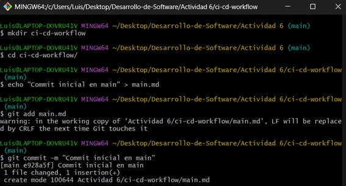

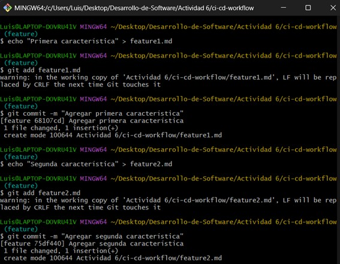

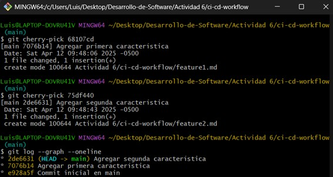

**Preguntas:**
1. ¿Cómo utilizarías cherry-pick en un pipeline de CI/CD para mover solo ciertos cambios listos a producción?
Cuando se trabaja con un pipeline CI/CD, cherry-pick nos permite mover ciertos commits a la parte de despliegue, sin alterar lo que aún está en progreso, manteniendo la regla de entregas continuas sin que aparezcan errores.

2. ¿Qué ventajas ofrece cherry-pick en un flujo de trabajo de DevOps?
Cherry-pick nos da esa flexibilidad de elección, permitiéndonos elegir ciertos commits de una rama para pasarlos a otra rama. En DevOps, cherry-pick nos permite agarrar ciertos commits que son necesarios para producción o pruebas. Una ventaja es que nos permite dividir lo probado de lo que aún está en desarrollo.


## Git, Scrum y Sprints
### Fase 1: Planificación del sprint (sprint planning)


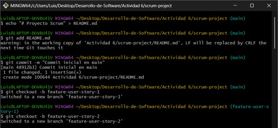

**Pregunta:** ¿Por qué es importante trabajar en ramas de funcionalidades separadas durante un sprint?

Porque nos permite que el trabajo de cada miembro se desarrolle de manera aislada, dejando de interferir en los trabajos de otros miembros, reduciendo la probabilidad de conflictos. Además ayuda a mejorar la organización del proyecto.

### Fase 2: Desarollo del sprint (sprint execution)

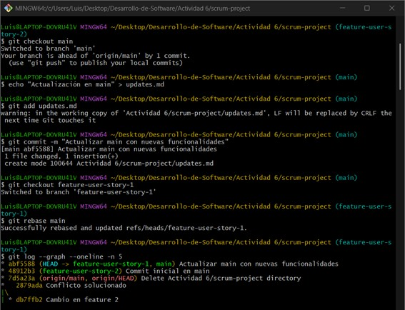

**Pregunta:** ¿Qué ventajas proporciona el rebase durante el desarrollo de un sprint en términos de integración continua?

El rebase nos permite mantener una parte actualizada de la rama main en cada rama, evitando conflictos al final del sprint. Cada miembro trabaja con el código mas reciente evitando alteraciones en el historial. También, permite una integración más fluida, ya que los nuevos códigos se van adaptando progresivamente a los cambios globales.

### Fase 3: Revisión del sprint (sprint review)

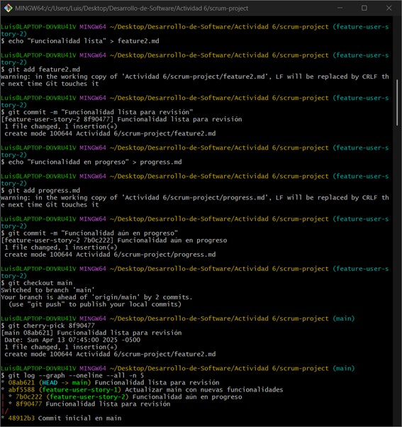

**Pregunta:** ¿Cómo ayuda `git cherry-pick` a mostrar avances de forma selectiva en un sprint review?

Cherry-pick nos permite elegir commits especificos que estén listos para llevarlos a la rama main, en vez de fusionar toda la rama entera. En el caso de un sprint review, cherry-pick nos ayuda a mostrar el avance verdadero al cliente, sin comprometer otras partes que todavia están en desarrollo.

### Fase 4: Retrospectiva del sprint (sprint retrospective)

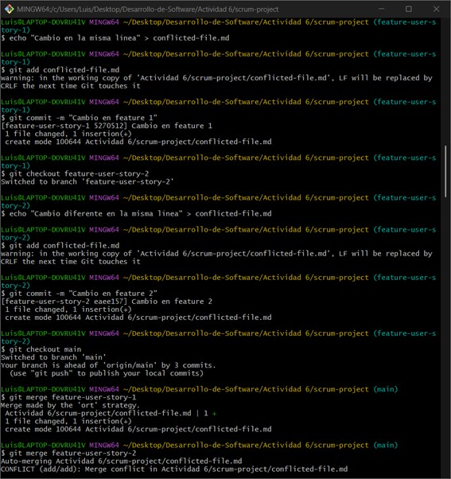

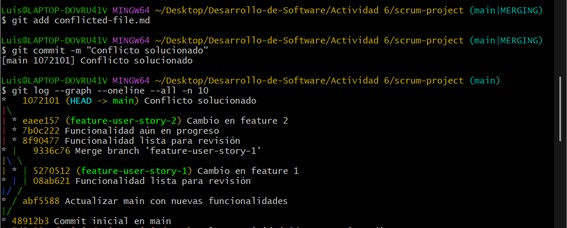

**Pregunta:** ¿Cómo manejas los conflictos de fusión al final de un sprint? ¿Cómo puede el equipo mejorar la comunicación para evitar conflictos grandes?

Los conflictos de fusión se pueden resolver de manera manual, revisando los archivos donde se originan los conflictos. Se pueden evitar conflictos grandes mejorando la comunicación del equipo, haciendo pulls frecuentemente y aplicando buenas prácticas como hacer commits pequeños y bien documentados.

### Fase 5: Fase de desarrollo, automatización de integración continua (CI) con git rebase

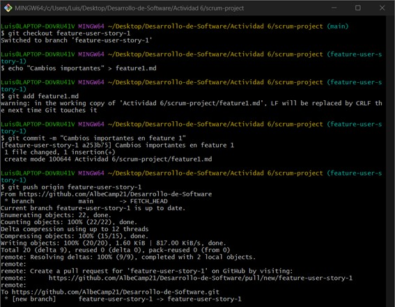

**Pregunta:** ¿Qué ventajas y desventajas observas al automatizar el rebase en un entorno de CI/CD?

Una ventaja es que nos asegura que el código siempre se mantenga actualizado antes de realizar push, reduciendo los conflictos. Una desventaja es que el rebase puede fallar por un conflicto, por ejemplo; interruptiendo los push y generando un efecto de bola de nieve si es que no se corrige.

## Navegando conflictos y versionado en un entorno DevOps
### Ejemplo
1. Inicialización del proyecto y creación de ramas

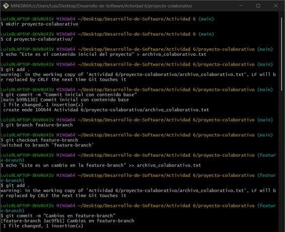

2. Fusión y resolución de conflictos

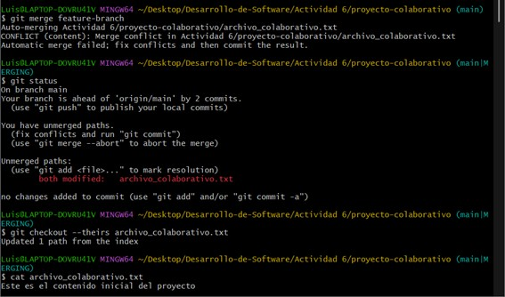

3. Simulación de fusiones y uso de git diff, git mergetool, git revert y git reset

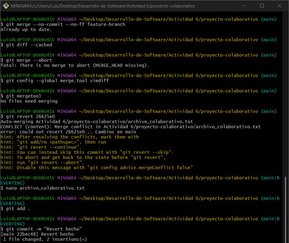

4. Versionado semántico y etiquetado y aplicación de git bisect para depuración

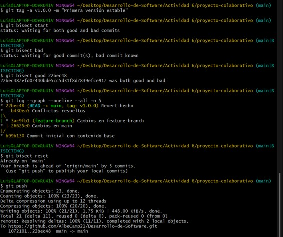

5. Documentación y reflexión

### Preguntas
#### 1. Ejercicio para git checkout --ours y git checkout --theris
**Contexto**: En un sprint ágil, dos equipos están trabajando en diferentes ramas. Se produce un conflicto de fusión en un archivo de configuración crucial. El equipo A quiere mantener sus cambios mientras el equipo B solo quiere conservar los suyos. El proceso de entrega continua está detenido debido a este conflicto.
**Pregunta**:  
¿Cómo utilizarías los comandos `git checkout --ours` y `git checkout --theirs` para resolver este conflicto de manera rápida y eficiente? Explica cuándo preferirías usar cada uno de estos comandos y cómo impacta en la pipeline de CI/CD. ¿Cómo te asegurarías de que la resolución elegida no comprometa la calidad del código?

Se puede usar `--ours` o `--theirs` dependiendo de lo que se quiera mantener. Para este caso, se debería analizar que archivo de configuración es más eficiente o consultar con el cliente. Si se eligen los cambios del equipo A, se debe usar `git checkout --ours` (en caso de que se está trabajando en la rama donde el equipo A hizo sus cambios).
Se usar `git checkout --ours` cuando se quiere mantener los cambios hechos en la rama actual. En cambio, se usa `git checkout --theirs` cuando se quieren mantener los cambios hechos en la rama que se está fusionando.
Se puede asegurar que la resolución no afecte la calidad del código validando el archivo antes de hacer commit y realizando pruebas automatizadas.

#### 2. Ejercicio para git diff
**Contexto**: Durante una revisión de código en un entorno ágil, se observa que un pull request tiene una gran cantidad de cambios, muchos de los cuales no están relacionados con la funcionalidad principal. Estos cambios podrían generar conflictos con otras ramas en la pipeline de CI/CD.
**Pregunta**:  
Utilizando el comando `git diff`, ¿cómo compararías los cambios entre ramas para identificar diferencias específicas en archivos críticos? Explica cómo podrías utilizar `git diff feature-branch..main` para detectar posibles conflictos antes de realizar una fusión y cómo esto contribuye a mantener la estabilidad en un entorno ágil con CI/CD.

Para estos casos, es recomendable usar `git diff` con las ramas que se quieren comparar. Esto nos permite ver los archivos modificados línea por línea.
Ahora, se puede usar `git diff feature-branch..main` para revisar cambios incompatibles entre estas ramas. Esto nos evita conflictos en la fusión de un mismo archivo que fue modificado por diferentes desarrolladores.
Estos comandos nos ayuda a mantener un entorno ágil en CI/CD ya que nos permite identificar y resolver conflictos antes de realizar la fusión, evitando que se detenga el pipeline.

#### 3. Ejercicio para git merge --no-commit --no-ff
**Contexto**: En un proyecto ágil con CI/CD, tu equipo quiere simular una fusión entre una rama de desarrollo y la rama principal para ver cómo se comporta el código sin comprometerlo inmediatamente en el repositorio. Esto es útil para identificar posibles problemas antes de completar la fusión.
**Pregunta**:  
Describe cómo usarías el comando `git merge --no-commit --no-ff` para simular una fusión en tu rama local. ¿Qué ventajas tiene esta práctica en un flujo de trabajo ágil con CI/CD, y cómo ayuda a minimizar errores antes de hacer commits definitivos? ¿Cómo automatizarías este paso dentro de una pipeline CI/CD?

Se usaría dicho comando para realizar el merge sin realizar un commit. Se fusiona ambas ramas pero se "detiene" antes de hacer el commit, dándonos la posibilidad de revisar el resultado o verificar el código resultante.
Una ventaja de usar este comando es que brinda un mayor control en las integraciones. En el caso de CI/CD, esto nos brinda una manera segura de verificar el comportamiento del código ya combinado antes de hacerle commit.
Ahora, si se quiere automatizar dentro de un pipeline, se podría configurar un proceso que realice merges simulados, usando dicho comando, en entornos de prueba. Por ejemplo, se podría usar un container que clona el repositorio, se ubica en la rama main y realiza la fusión con la rama donde se hizo cambios. Luego, pasaría por pruebas unitarias y, si las pasa, se valida  y se realiza el merge en el repositorio real.

#### 4. Ejercicio para git mergetool
**Contexto**: Tu equipo de desarrollo utiliza herramientas gráficas para resolver conflictos de manera colaborativa. Algunos desarrolladores prefieren herramientas como vimdiff o Visual Studio Code. En medio de un sprint, varios archivos están en conflicto y los desarrolladores prefieren trabajar en un entorno visual para resolverlos.
**Pregunta**:  
Explica cómo configurarías y utilizarías `git mergetool` en tu equipo para integrar herramientas gráficas que faciliten la resolución de conflictos. ¿Qué impacto tiene el uso de `git mergetool` en un entorno de trabajo ágil con CI/CD, y cómo aseguras que todos los miembros del equipo mantengan consistencia en las resoluciones?

Para hacer uso del comando `git mergetool` primero debemos tener tener una herramienta como VSCode o vimdiff. Luego elegirla con `git config --global merge.tool <herramienta>`. Listo, ya tendríamos listo para ejecutar `git mergetool` luego de que encontremos un conflicto.
Ahora, el uso de este comando en CI/CD trae beneficios, por ejemplo facilita la resolución de conflictos y lo hace de manera intuitiva al tener este apoyo visual que nos brinda.
Por último, si se quiere mantener una consistencia entre las resoluciones de diferentes miembros del equipo es importante definir políticas, como por ejemplo que herramienta gráfica se va a usar. Una opción también puede ser automatizar la configuración básica, para garantizar que todos los desarrolladores tengan el mismo entorno.

#### 5. Ejercicio para git reset
**Contexto**: En un proyecto ágil, un desarrollador ha hecho un commit que rompe la pipeline de CI/CD. Se debe revertir el commit, pero se necesita hacerlo de manera que se mantenga el código en el directorio de trabajo sin deshacer los cambios.
**Pregunta**:  
Explica las diferencias entre `git reset --soft`, `git reset --mixed` y `git reset --hard`. ¿En qué escenarios dentro de un flujo de trabajo ágil con CI/CD utilizarías cada uno? Describe un caso en el que usarías `git reset --mixed` para corregir un commit sin perder los cambios no commiteados y cómo afecta esto a la pipeline.

Los tres comandos que nos muestran se usan para realizar commits, pero tienen algunas diferencias. `git reset --soft` mueve el puntero de HEAD a un commit anterior pero mantiene los cambios hechos en el área de staging. De igual manera, `git reset --mixed` mueve el HEAD, pero este sí borra los cambios del staging, dejándolo solamente localmente. Por último `git reset --hard` borra completamente el cambio, por lo cual se recomienda usarlo con cuidado.
En un flujo de trabajo ágil, cada uno de estos comandos se puede usar dependiendo de la situación. `git reset --soft` se puede usar si se quiere rehacer un commit pero que se quiere conservar listo para un futuro commit. `git reset --mixed` se usa cuando se tiene que verificar qué es lo que se va a commitear, haciendo una selección más minuciosa de los commits. Por último `git reset --hard` se puede usar cuando se quiere volver completamente atrás sin importar la pérdida local de dichos cambios.
Un ejemplo donde se usa `git reset --mixed` puede ser cuando se hace un commit de manera apresurada, siendo valido parcialmente, donde hemos hecho commit a un código sin probarlo, luego notamos que nos equivocamos en una palabra, entonces debemos quitar ese commit pero no borrar todo el código.

#### 6. Ejercicio para git revert
**Contexto**: En un entorno de CI/CD, tu equipo ha desplegado una característica a producción, pero se ha detectado un bug crítico. La rama principal debe revertirse para restaurar la estabilidad, pero no puedes modificar el historial de commits debido a las políticas del equipo.
**Pregunta**:  
Explica cómo utilizarías `git revert` para deshacer los cambios sin modificar el historial de commits. ¿Cómo te aseguras de que esta acción no afecte la pipeline de CI/CD y permita una rápida recuperación del sistema? Proporciona un ejemplo detallado de cómo revertirías varios commits consecutivos.

A comparación de `git reset`, `git revert` sí realiza un commit que revierte lo que hayamos especificado, siendo no tan abrupto como el reset.
Para asegurarnos de que el pipeline no falle, se puede optar por opciones como una reversión de manera local. Con el nuevo commit, se ejecutará nuevamente el pipeline y verificará si todo funciona bien.
Ahora, si se quiere revertir varios commits consecutivos podemos usar el comando `git revert HEAD~<# de commits>..HEAD`. Como aplicamos revert, esto creará un commit donde deshace estos commits.

#### 7. Ejercicio para git stash
**Contexto**: En un entorno ágil, tu equipo está trabajando en una corrección de errores urgente mientras tienes cambios no guardados en tu directorio de trabajo que aún no están listos para ser committeados. Sin embargo, necesitas cambiar rápidamente a una rama de hotfix para trabajar en la corrección.
**Pregunta**:  
Explica cómo utilizarías `git stash` para guardar temporalmente tus cambios y volver a ellos después de haber terminado el hotfix. ¿Qué impacto tiene el uso de `git stash` en un flujo de trabajo ágil con CI/CD cuando trabajas en múltiples tareas? ¿Cómo podrías automatizar el proceso de _stashing_ dentro de una pipeline CI/CD?

Podemos usar `git stash` para guardar temporalmente los cambios que tengamos de manera local sin necesidad de hacer un commit. Esto nos permite cambiar a la rama hotfix sin perder nuestro progreso, y una vez terminado, podemos volver a la rama en donde estamos trabajando, usar `git stash pop` y recuperar los cambios que estabamos realizando antes.
En un flujo de trabajo ágil con CI/CD, el stash nos facilita movernos entre tareas sin afectar al pipeline. Se puede automatizar el stash usando scripts de la pipeline.

#### 8. Ejercicio para .gitignore
**Contexto**: Tu equipo de desarrollo ágil está trabajando en varios entornos locales con configuraciones diferentes (archivos de logs, configuraciones personales). Estos archivos no deberían ser parte del control de versiones para evitar confusiones en la pipeline de CI/CD.
**Pregunta**:  
Diseña un archivo `.gitignore` que excluya archivos innecesarios en un entorno ágil de desarrollo. Explica por qué es importante mantener este archivo actualizado en un equipo colaborativo que utiliza CI/CD y cómo afecta la calidad y limpieza del código compartido en el repositorio.

```
# Archivos temporales
*.tmp
*.log
*.lock

# Directorios de salida de compilación
**/bin
**/out
```
Es importante mantener el gitignore actualizado ya que subir archivos innecesarios puede provocar errores en la pipeline en CI/CD, causando conflictos y afectando la calidad del código. Usando el gitignore evitamos que configuraciones personales afecten con el trabajo del proyecto.

## Ejercicios adicionales
### Ejercicio 1: Resolución de conflictos en un entorno ágil
**Contexto:**  
Estás trabajando en un proyecto ágil donde múltiples desarrolladores están enviando cambios a la rama principal cada día. Durante una integración continua, se detectan conflictos de fusión entre las ramas de dos equipos que están trabajando en dos funcionalidades críticas. Ambos equipos han modificado el mismo archivo de configuración del proyecto.
**Pregunta:**
¿Cómo gestionarías la resolución de este conflicto de manera eficiente utilizando Git y manteniendo la entrega continua sin interrupciones? ¿Qué pasos seguirías para minimizar el impacto en la CI/CD y asegurar que el código final sea estable?

Primero se debe identificar el archivo que está generando dicho conflicto, luego comunicar a ambos equipos para debatir sobre sus cambios, haciendo una revisión conjunta para decidir qué partes del código conservar. Para minimizar el impacto en la CI/CD, es importante testear el código de manera local y usar pruebas automatizadas, así nos aseguramos que no se rompa la pipeline.

### Ejercicio 2: Rebase vs Merge en integraciones ágiles
**Contexto:**  
En tu equipo de desarrollo ágil, cada sprint incluye la integración de varias ramas de características. Algunos miembros del equipo prefieren realizar merge para mantener el historial completo de commits, mientras que otros prefieren rebase para mantener un historial lineal.
**Pregunta:**
¿Qué ventajas y desventajas presenta cada enfoque (merge vs. rebase) en el contexto de la metodología ágil? ¿Cómo impacta esto en la revisión de código, CI/CD, y en la identificación rápida de errores?

La ventaja de usar merge es que conservamos el historial de cómo se intregaron las ramas, pero, puede provocar un historial complejo con varios commits de merges. Ahora, hablando de rebase, la ventaja es que nos permite tener un historial lineal y limpio, facilitando la lectura. Sin embargo, puede ocasionar conflictos o reescritura del historial si no se usa de manera correcta. En el área de CI/CD, ambos son útiles dependiendo de lo que se quiera hacer y del nivel del proyecto. Merge facilita la identificación de errores y de su momento de integración, por otro lado, rebase hace que los cambios se integren de manera ordenada. 

### Ejercicio 3: Git Hooks en un flujo de trabajo CI/CD ágil
**Contexto:**  
Tu equipo está utilizando Git y una pipeline de CI/CD que incluye tests unitarios, integración continua y despliegues automatizados. Sin embargo, algunos desarrolladores accidentalmente comiten código que no pasa los tests locales o no sigue las convenciones de estilo definidas por el equipo.
**Pregunta:**
Diseña un conjunto de Git Hooks que ayudaría a mitigar estos problemas, integrando validaciones de estilo y tests automáticos antes de permitir los commits. Explica qué tipo de validaciones implementarías y cómo se relaciona esto con la calidad del código y la entrega continua en un entorno ágil.

Se pueden usar hooks para mejorar la calidad del código y reducir los errores en la pipeline CI/CD.  Por ejemplo configurar `pre-commit`, que puede configurarse para ejecutar linters. El hook `pre-push` puede correr pruebas como tests de integración o validaciones de dependencias antes de que los cambios se suban al repositorio remoto. En caso de que la validación falle, se cancela el push.
Esto asegura errores en producción ya que el código pasa por controles básicos , también mantiene el flujo estable.

### Ejercicio 4: Estrategias de branching en metodologías ágiles
**Contexto:**  
Tu equipo de desarrollo sigue una metodología ágil y está utilizando Git Flow para gestionar el ciclo de vida de las ramas. Sin embargo, a medida que el equipo ha crecido, la gestión de las ramas se ha vuelto más compleja, lo que ha provocado retrasos en la integración y conflictos de fusión frecuentes.
**Pregunta:**
Explica cómo adaptarías o modificarías la estrategia de branching para optimizar el flujo de trabajo del equipo en un entorno ágil y con integración continua. Considera cómo podrías integrar feature branches, release branches y hotfix branches de manera que apoyen la entrega continua y minimicen conflictos.

Para estos casos, se puede usar estrategias más ligeras, como por ejemplo Trunk-Based Development, donde se trabaja con ramas cortas que provienen de la rama principal. Estas ramas puedes fusionarse rápidamente para evitar que se acumulen.
Las release branches pueden usarse unicamente para cuando se requiera estabilizar antes del despliegue. Las hotfix branches se usan exclusivamente para corregir errores, haciendolas merge rápidamente cuando se corrijan.


### Ejercicio 5: Automatización de reversiones con git en CI/CD
**Contexto:**  
Durante una integración continua en tu pipeline de CI/CD, se detecta un bug crítico después de haber fusionado varios commits a la rama principal. El equipo necesita revertir los cambios rápidamente para mantener la estabilidad del sistema.
**Pregunta:**
¿Cómo diseñarías un proceso automatizado con Git y CI/CD que permita revertir cambios de manera eficiente y segura? Describe cómo podrías integrar comandos como `git revert` o `git reset` en la pipeline y cuáles serían los pasos para garantizar que los bugs se reviertan sin afectar el desarrollo en curso.

Para revertir cambios en una pipeline CI/CD, se puede usar `git revert`, ya que crea commits que deshacen los cambios sin modificar el historial. Un proceso automatizado puede incluir en la pipeline que al detectar un error o bug, se ejecute un script donde se ejecute el revert sobre dichos commits que ocasionaron dicho error. Ahora, para evitar que esto afecte al desarrollo, es importante que se pueda aislar los cambios revertidos a una nueva rama o simplemente incluir revisiones automáticas antes de realizar push.
