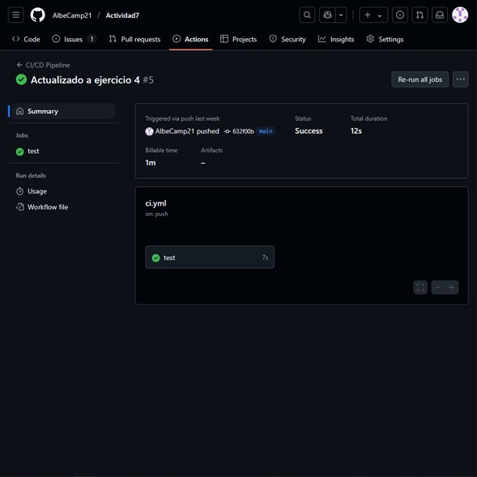
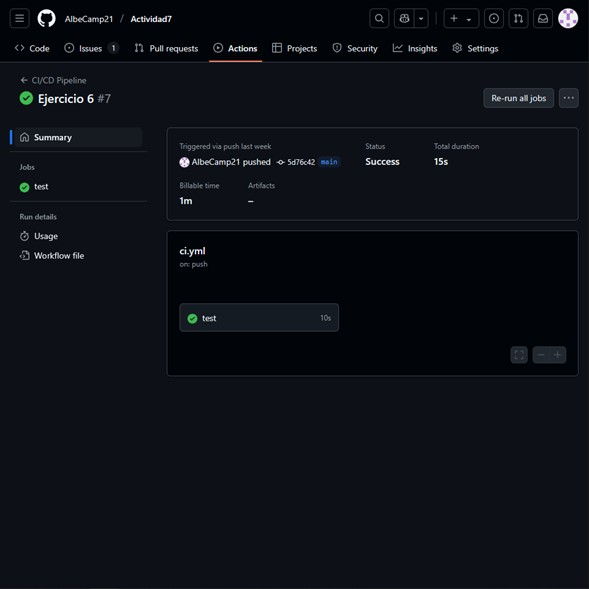
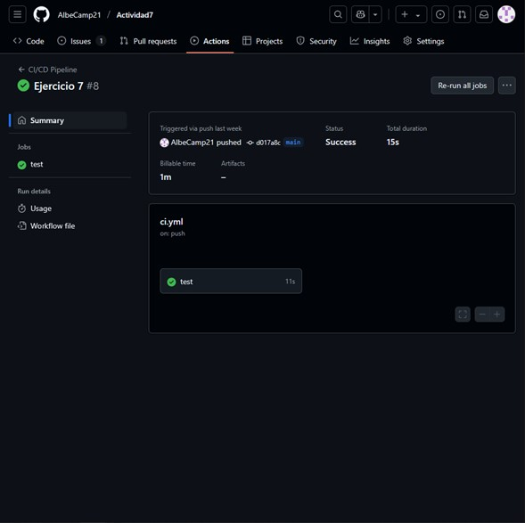
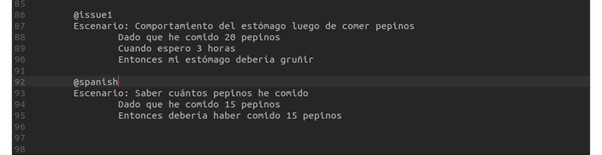
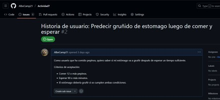
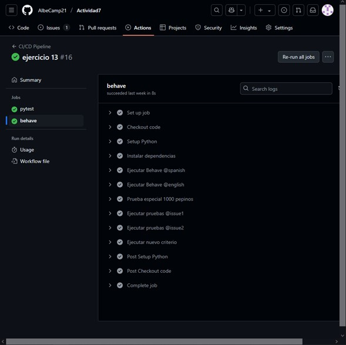
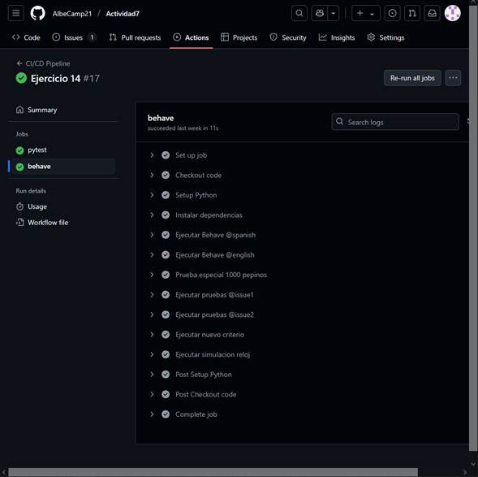

# ACTIVIDAD 7
### Creando directorio de trabajo y archivos necesarios

### Ejercicio 1: Añadir soporte para minutos y segundos en tiempos de espera

1. Modifica la función que maneja el tiempo en steps.py

2. Implementa un escenario de prueba en Gherkin

3. Pruebas unitarias

4. Creando pipeline CI/CD

### Ejercicio 2: Manejo de cantidades fraccionarias de pepinos

1. Modifica clase Belly y los steps para que acepten entradas como 0.5

2. Implementa nuevos escenarios en Gherkin

3. Crea nuevas pruebas unitarias

4. Pipeline

### Ejercicio 3: Soporte para idiomas múltiples (Español e ingles)

1. Modifica el parsing de tiempos para que reconozca palabras clave en inglés

2. Escribe al menos dos escenarios de prueba en Gherkin

3. Pipeline: dividir los escenarios por tags

### Ejercicio 4: Manejo de tiempos aleatorios

1. Permitir rangos de tiempos

2. Implementa nuevos escenarios en Gherkin

3. Pipeline

### Ejercicio 5: Validación de cantidad no válidas

1. Añade validaciones para evitar ciertos rangos

2. Modifica la lógica para arrojar un excepción

3. Implementa un escenario de prueba

4. Pipeline

### Ejercicio 6: Escalabilidad con grandes cantidades de pepinos

1. Añade soporte para manejar cantidades, como 1000

2. En el pipeline ejecuta pruebas de larga duración

### Ejercicio 7: Descripciones de tiempos complejas

1. Implementa escenarios que cubran variaciones complejas en Gherkin

2.  Puedes analizar la cobertura de pruebas (coverage)

### Ejercicio 8: De TDD a BDD - Convertir requisitos técnicos a pruebas en Gherkin

1. Escriba un test unitario que valide que si se ha comido más de 10 pepinos y se espera 2 horas, el estómago gruñe

2. Pasa el test a un escenario Gherkin

3. Pipeline: Ejecuta primero los tests unitarios y luego los tests de Behave

### Ejercicio 9: Identificación de criterios de aceptación para historias de usuario

1. Toma la historia de usuario:

2. Escribe escenarios en Gherkin

3. Pepiline: Vincula GitHub Issues

### Ejercicio 10: Escribir pruebas unitarias antes de escenarios BDD

1. Escribe un test unitario para una nueva función

2. Crea un escenario en Gherkin que describa el comportamiento

3. Pipeline: Etapas separas de Pytest y Behave

### Ejercicio 11: Refactorización guiada por TDD y BDD

1. Escribe pruebas unitarias para una funcionalidad ya existente

2. Refactoriza el código para mejorar eficiencia

3. Pipeline

### Ejercicio 12: Ciclo completo de TDD a BDD - Añadir nueva funcionalidad

1. Imagina una nueva funcionalidad, por ejemplo predecir si el estómago gruñirá

2. Conviértelo en una historia de usuario

3. Implementa y verifica el escenario Gherkin

4. Pipeline

### Ejercicio 13: Añadir criterios de aceptación claros

1. Definir una nueva historia y crear 2-3 criterios de aceptación

2. Pasando a prueba Gherkin

3. Pipeline

### Ejercicio 14: Integración con Mocking, Stubs y Fakes (para DevOps)

1. Crea un archivo `servicio_tiempos`, con una función `get_current_time`

2. Modifica `Belly` para aceptar un `clock_service`

3. Crea nuevos tests unitarios

4. Crea nueve situación

5. Pipeline

### Ejercicio 15: Despliegue y validación continua en un entorno de integración (CI/CD)

1. Configura un pipeline agregando verificación de calidad de código

2. Pipeline

