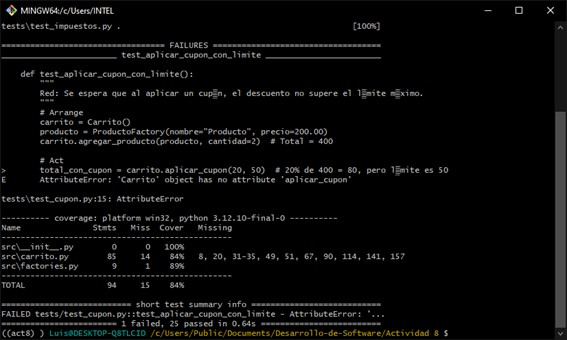
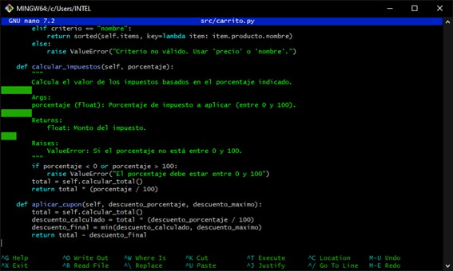
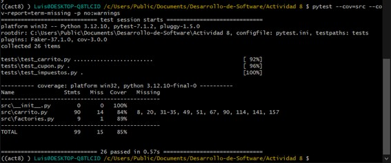

# ACTIVIDAD 8

### Ejercicio 1: Método para vaciar el carrito

Implementa en la clase `Carrito` un método llamado `vaciar()` que elimine todos los items del carrito. Luego, escribe pruebas siguiendo el patrón AAA para verificar que, al vaciar el carrito, la lista de items quede vacía y el total sea 0.

### Ejercicio 2: Descuento por compra mínima

Amplía la lógica del carrito para aplicar un descuento solo si el total supera un monto determinado. Por ejemplo, si el total es mayor a $500, se aplica un 15% de descuento.

### Ejercicio 3: Manejo de stock en producto

Modifica la clase `Producto` para que incluya un atributo `stock` (cantidad disponible). Luego, actualiza el método `agregar_producto` en `Carrito` para que verifique que no se agregue una cantidad mayor a la disponible en stock. Si se intenta agregar más, se debe lanzar una excepción.

### Ejercicio 4: Ordenar items del carrito

Agrega un método en `Carrito` que devuelva la lista de items ordenados por un criterio (por ejemplo, por precio unitario o por nombre del producto).

### Ejercicio 5: Uso de Pytest Fixtures

Refactoriza las pruebas para que utilicen fixtures de Pytest, de modo que se reutilicen instancias comunes de `Carrito` o de productos.

### Ejercicio 6: Pruebas parametrizadas

Utiliza la marca `@pytest.mark.parametrize` para crear pruebas que verifiquen múltiples escenarios de descuento o actualización de cantidades.

### Ejercicio 7: Calcular impuestos en el carrito

Implementar un método `calcular_impuestos(porcentaje)` que retorne el valor del impuesto calculado sobre el total del carrito.

### Ejercicio 8: Aplicar cupón de descuento con límite máximo

Implementar un método `aplicar_cupon(descuento_porcentaje, descuento_maximo)` que aplique un cupón de descuento al total del carrito, pero asegurándose de que el descuento no supere un valor máximo.

### Ejercicio 9: Validación de stock al agregar productos (RGR)

Asegurarse de que al agregar un producto al carrito, no se exceda la cantidad disponible en stock.

