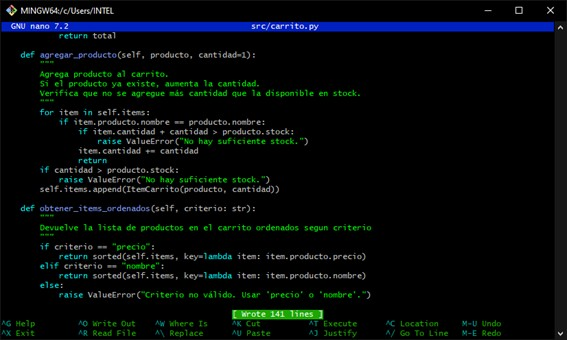

# ACTIVIDAD 8

### Ejercicio 1: Método para vaciar el carrito

Implementa en la clase `Carrito` un método llamado `vaciar()` que elimine todos los items del carrito. Luego, escribe pruebas siguiendo el patrón AAA para verificar que, al vaciar el carrito, la lista de items quede vacía y el total sea 0.

**1.1.** Creando la función `vaciar()` dentro de la clase `Carrito`

**1.2.** Creando su respectivo test, llamándolo `test_vaciar_carrito()`

**1.3.** Ejecutando `pytest`

### Ejercicio 2: Descuento por compra mínima

Amplía la lógica del carrito para aplicar un descuento solo si el total supera un monto determinado. Por ejemplo, si el total es mayor a $500, se aplica un 15% de descuento.

**2.1.** Creando la función `aplicar_descuento_condicion()` dentro de la clase `Carrito`

**2.2.** Creando su respectivo test, llamándolo `test_aplicar_descuento()`

**2.3.** Ejecutando `pytest`

### Ejercicio 3: Manejo de stock en producto

Modifica la clase `Producto` para que incluya un atributo `stock` (cantidad disponible). Luego, actualiza el método `agregar_producto` en `Carrito` para que verifique que no se agregue una cantidad mayor a la disponible en stock. Si se intenta agregar más, se debe lanzar una excepción.

**3.1.** Modificando la clase `Producto`, para que el stock se genere de manera aleatoria

**3.2.** Modificando la clase `agregar_producto()` para que verifique que no se exceda el stock

**3.3.** Ejecutando `pytest`

### Ejercicio 4: Ordenar items del carrito

Agrega un método en `Carrito` que devuelva la lista de items ordenados por un criterio (por ejemplo, por precio unitario o por nombre del producto).

**4.1.** Agregando la función `obtener_item_ordenado()`, donde hay opción de ordenar los items según sus precios o sus nombres

**4.2.** Creando su respectivo test, llamándolo `test_ordenar_items_por_nombre()`

**4.3.** Ejecutando `pytest`

### Ejercicio 5: Uso de Pytest Fixtures

Refactoriza las pruebas para que utilicen fixtures de Pytest, de modo que se reutilicen instancias comunes de `Carrito` o de productos.

**5.1.** Creando un fixture para reutilizar instancias comunes, en este caso un producto genérico

**5.2** Modificando todos los tests para que usen el producto genérico

**5.3.** Ejecutando `pytest`

### Ejercicio 6: Pruebas parametrizadas

Utiliza la marca `@pytest.mark.parametrize` para crear pruebas que verifiquen múltiples escenarios de descuento o actualización de cantidades.

**6.1.** Agregando tests que prueben casos como descuentos o cantidades

**6.2.** Ejecutando `pytest`

### Ejercicio 7: Calcular impuestos en el carrito

Implementar un método `calcular_impuestos(porcentaje)` que retorne el valor del impuesto calculado sobre el total del carrito.

**7.1.** Creando el archivo `test_impuestos.py` que contiene el test `test_calcular_impuestos()`

**7.2.** Ejecutando `pytest`

**7.3.** Creando la función `calcular_impuestos()`

### Ejercicio 8: Aplicar cupón de descuento con límite máximo

Implementar un método `aplicar_cupon(descuento_porcentaje, descuento_maximo)` que aplique un cupón de descuento al total del carrito, pero asegurándose de que el descuento no supere un valor máximo.

**8.1.** Creando el archivo `test_cupon.py` que contiene el test `test_aplicar_cupon_con_limite()`

**8.2.** Creando la función `aplicar_cupon()`

**8.3.** Ejecutando `pytest`

### Ejercicio 9: Validación de stock al agregar productos (RGR)

Asegurarse de que al agregar un producto al carrito, no se exceda la cantidad disponible en stock.

**9.1. RED:** Creando el archivo `test_stock.py` que contiene el test `test_agregar_producto_excede_()`

**9.2.** Ejecutando `pytest`

**9.3. GREEN:** Agregando la función `agregar_producto()`

**9.4.** Ejecutando `pytest`

**9.5. REFACTOR:** Mejorando la función `agregar_producto()`

**9.6.** Ejecutando `pytest`

