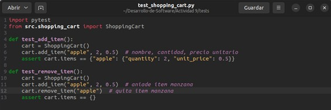
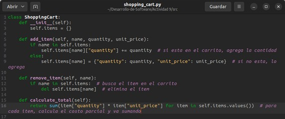
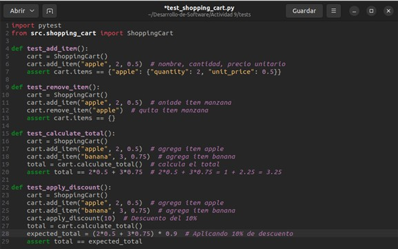
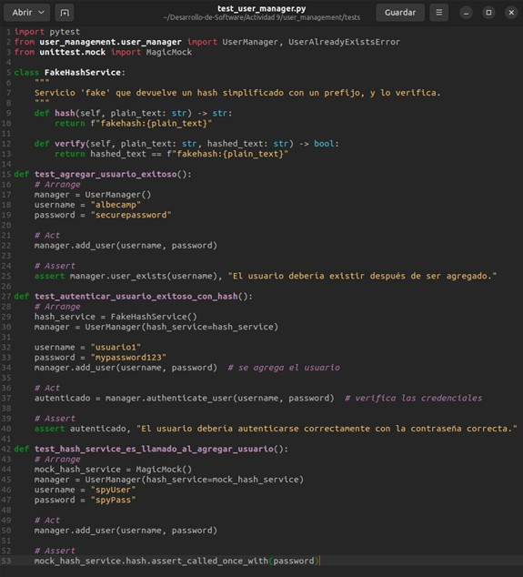

# ACTIVIDAD 9

## Actividad: Red-Green-Refactor

### Primera iteración (RGR 1): Agregar artículos al carrito
1. Escribir una prueba que falle (Red)

2. Implementar el código para pasar la prueba (Green)

3. Refactorizar el código si es necesario (Refactor)
En este caso, no es necesario.

### Segunda iteración (RGR 2): Eliminar artículos del carrito

1. Escribir una prueba que falle (Red)

2. Implementar el código para pasar la prueba (Green)

3. Refactorizar el código si es necesario (Refactor)

### Tercera iteración (RGR 3): Calcular el total del carrito

1. Escribir una prueba que falle (Red)

2. Implementar el código para pasar la prueba (Green)

3. Refactorizar el código si es necesario (Refactor)

### Ejecutando las pruebas

### Cuarta iteración (RGR 4): Agregar artículos al carrito

1. Escribir una prueba que falle (Red)

2. Implementar el código para pasar la prueba (Green)

3. Refactorizar el código si es necesario (Refactor)
En este caso, no es necesario.

### Quinta iteración (RGR 5): eliminar artículos del carrito

1. Escribir una prueba que falle (Red)

2. Implementar el código para pasar la prueba (Green)

3. Refactorizar el código si es necesario (Refactor)

### Sexta iteración (RGR 6): calcular el total del carrito

1. Escribir una prueba que falle (Red)

2. Implementar el código para pasar la prueba (Green)

3. Refactorizar el código si es necesario (Refactor)

### Séptima iteración (RGR 7): aplicar descuentos al total

1. Escribir una prueba que falle (Red)

2. Implementar el código para pasar la prueba (Green)

3. Refactorizar el código si es necesario (Refactor)

### Ejecutando las pruebas

## RGR, mocks, stubs e inyección de dependencias

### Octava iteración (RGR 8): agregar artículos al carrito

1. Escribir una prueba que falle (Red)

2. Implementar el código para pasar la prueba (Green)

3. Refactorizar el código si es necesario (Refactor)
En este caso, no es necesario.

### Novena iteración (RGR 9): eliminar artículos del carrito

1. Escribir una prueba que falle (Red)

2. Implementar el código para pasar la prueba (Green)

3. Refactorizar el código si es necesario (Refactor)

### Décima iteración (RGR 10): calcular el total del carrito

1. Escribir una prueba que falle (Red)

2. Implementar el código para pasar la prueba (Green)

3. Refactorizar el código si es necesario (Refactor)

### Onceava iteración (RGR 11): aplicar descuentos al total

1. Escribir una prueba que falle (Red)

2. Implementar el código para pasar la prueba (Green)

3. Refactorizar el código si es necesario (Refactor)

Podemos mantener la implementación actual, ya que ya hemos añadido validaciones y redondeo adecuado.

### Doceava iteración (RGR 5): Procesar Pagos a través de un Servicio Externo

1. Escribir una prueba que falle (Red)

2. Implementar el código para pasar la prueba (Green)

3. Refactorizar el código si es necesario (Refactor)

### Ejecutando las pruebas

## Ejercicio

### Iteración 1: Agregar usuario (Básico)

- Paso 1 (Red): Escribimos la primera prueba

- Paso 2 (Green): Implementamos lo mínimo para que pase la prueba

- Paso 3 (Refactor)
Revisamos que el código sea claro y conciso. Por ahora, el diseño es simple y cumple su función.

### Iteración 2: Autenticación de usuario (Introducción de una dependencia para Hashing)

- Paso 1 (Red): Escribimos la primera prueba

- Paso 2 (Green): Implementamos la funcionalidad y la DI

- Paso 3 (Refactor)
Podemos refactorizar si lo consideramos necesario, pero por ahora la estructura cumple el propósito.

### Iteración 3: Uso de un Mock para verificar llamadas (Spy / Mock)

- Paso 1 (Red): Escribimos la prueba de "espionaje"

- Paso 2 (Green): Probar que todo pasa

- Paso 3 (Refactor)
No hay cambios adicionales. El uso de Mocks/Spies simplemente corrobora el comportamiento interno.

### Iteración 4: Excepción al agregar usuario existente (Stubs/más pruebas negativas)

- Paso 1 (Red): Prueba

- Paso 2 (Green):

- Paso 3 (Refactor)
Nada adicional por el momento.

### Iteración 5: Agregar un "Fake" repositorio de datos (Inyección de Dependencias)

- Paso 1 (Red): Nueva prueba

- Paso 2 (Green): Implementación

- Paso 3 (Refactor)
El código quedó un poco más ordenado; `UserManager` no depende directamente de la estructura interna de almacenamiento.

### Iteración 6: Introducir un “Spy” de notificaciones (Envío de correo)

- Paso 1 (Red): Prueba

- Paso 2 (Green): Implementamos la llamada al servicio de correo

- Paso 3 (Refactor)
Podríamos refactorizar lo que queramos, pero la lógica principal es clara: si se inyecta `email_service`, se usa; si no, no se hace nada especial.

## Ejercicio Integral

### Iteración 1: Agregar usuario (Básico)

- Paso 1 (Red): Primera prueba

- Paso 2 (Green): Implementamos lo mínimo

- Paso 3 (Refactor)
Revisamos si el código está limpio. Por ahora está bien.

### Iteración 2: Autenticación con inyección de un servicio de Hashing (Fake)

- Paso 1 (Red): Nueva prueba

- Paso 2 (Green): Implementación con inyección de hash_service

- Paso 3 (Refactor)
El código se ve bien para esta etapa.

### Iteración 3: Uso de un Mock/Spy para verificar llamadas internas

- Paso 1 (Red): Prueba con Spy

- Paso 2 (Green):
Nuestra implementación ya invoca `hash(...)`, así que al correr `pytest` debería pasar sin cambios.

- Paso 3 (Refactor)
Nada que modificar

### Iteración 4: Uso de Stubs para forzar comportamientos

- Paso 1 (Red): Nueva prueba

- Paso 2 (Green): Implementación con inyección de hash_service

Ya tenemos en `add_user` la lógica que lanza la excepción si existe el usuario. La prueba debe pasar con normalidad

- Paso 3 (Refactor)
Sin modificaciones

### Iteración 5: Inyección de un repositorio (Fake)

- Paso 1 (Red): Prueba con un repositorio fake

- Paso 2 (Green): Implementación

- Paso 3 (Refactor)
El código se ve bien.

### Iteración 6: Spy de Servicio de Correo

- Paso 1 (Red): Prueba

- Paso 2 (Green): Implementación en `UserManager`

- Paso 3 (Refactor)
Código listo. Hemos visto el uso de un Mock/Spy para verificar interacciones.
