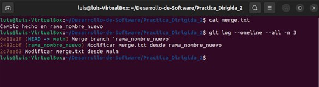

# PRÁCTICA DIRIGIDA 2

## Actividad: Exploración y administración avanzada de Git mediante un script interactivo

### Preguntas
-   **¿Qué diferencias observas en el historial del repositorio después de restaurar un commit mediante reflog?**
Cuando usamos `git reflog` podemos ver cada actualización del HEAD. Cuando usamos dicho comando para recuperar un commit y se apunta el HEAD hacia él, entonces el reflog lo registra de manera clara, pero al usar `git log` aún no se verán los cambios hasta que se mueva una rama sobre dicho commit.

-   **¿Cuáles son las ventajas y desventajas de utilizar submódulos en comparación con subtrees?**

| Tipo | Ventajas | Desventajas |
|---|---|---|
| Submódulos | Aísla el repositorio externo en una carpeta con su propio historial y con una versión fija. Además, nos facilita ir actualizando de manera controlada (`git submodule update --remote`). | Se requiere comandos adicionales, como `git submodule init` o `git submodule update` después de clonar y, si se quiere cambiar de rama, se debe sincronizar de manera manual la referencia del submódulo. |
| Subtrees | Se une el repositorio externo en en árbol principal, con solo `git pull` o `git merge` podemos actualizar todo. No se necesita de pasos extras al clonar ni hacer uso de dependencias externas. | Se mezcla el historial de ambos proyectos, incrementando el tamaño del repositorio y dificultando la actualización de cambios externos sin duplicar commits. |

-   **¿Cómo impacta la creación y gestión de hooks en el flujo de trabajo y la calidad del código?**
Los hooks nos permiten automatizar validaciones (como por ejemplo validar ciertos requisitos al momento de realizar commits). Nos ayuda a reducir errores tempranamente si los usamos como pre-commit o pre-push, pero, nos obligan a mantener los scripts sincronizados para cada entorno de desarrollo y puedes bloquear la colaboración si no se documentan correctamente.

-  **¿De qué manera el uso de `git bisect` puede acelerar la localización de un error introducido recientemente?**
El comando `git bisect` usa la búsqueda binaria dentro de un rango de commits, uno *bueno* y otro *malo*. Para cada paso, Git nos pide verificar el commit intermedio, y debemos marcarlo como *bueno* o *malo*, reduciendo a la mitad el conjunto de commits candidatos. Un dato extra es que al usar búsqueda binaria, pasamos de la complejidad por búsqueda lineal (O(n)) a O(log n).

-   **¿Qué desafíos podrías enfrentar al administrar ramas y stashes en un proyecto con múltiples colaboradores?**
	- Conflictos al realizar fusiones: Si varios desarrolladores modifican las mismas líneas o los mismos archivos, entonces al realizar `merge` o `rebase` puede aparecer conflictos, llevando a una perdida de tiempo por debatir con cual modificación quedarse.
	- Stashes olvidados: Existe el riesgo de olvidar o perder los cambios almacenados en stash si no se aplican en el momento oportuno, eso llevaría a la complicación cuando se quiera hacer un seguimiento del trabajo.
	- 

### Ejercicios

#### 1. Extiende el menú de gestión de ramas para incluir la funcionalidad de renombrar ramas.

- Se añade la opción *f) Renombrar una rama* en la sección *4) Gestión de ramas*:

- Resultado:

#### 2 . Amplia la sección de "Gestión de git diff" para permitir ver las diferencias de un archivo específico entre dos commits o ramas.

- Se añade la opción *e) Comparar diferencia de un archivo específico* en la sección *9) Gestión de git diff*:

- Commits previos:

- Resultado:

#### 3 . Crea una función que permita instalar automáticamente un hook que, por ejemplo, verifique si se han agregado comentarios de documentación en cada commit.

- Se añade la opción *f) Instalar hook para verificar correcta documentación* en la sección *10) Gestión de Hooks*:

- Resultado con error:

- Resultado correcto:

#### 4 . Implementa una opción en el script que realice un merge automatizado de una rama determinada en la rama actual, incluyendo la resolución automática de conflictos (siempre que sea posible).

- Se añade la opción *12) Merge automatizado de una rama*:

- Commits previos:

- Resultado:

#### 5 . Implementa una opción en el script que genere un reporte con información relevante del repositorio (estado, ramas, últimos commits, stashes, etc.) y lo guarde en un archivo.

- Se añade la opción *13) Generar reporte*:

- Resultado:

