# Práctica dirigida 3

## Herramientas del shell

1 . Lee la ayuda de [man ls](https://www.man7.org/linux/man-pages/man1/ls.1.html) y escribe un comando `ls` que liste archivos de la siguiente manera:

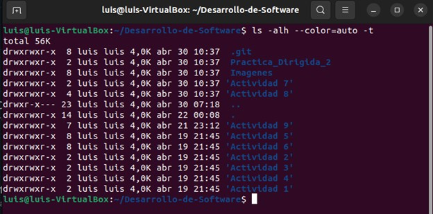

Se ejecuta el comando `ls -alh --color=auto -t`, lo cual cada opción hace:
- `ls`: muestra la lista de archivos y carpetas.
- `-a`: muestra archivos ocultos.
- `-l`: usa formato largo (muestra permisos, dueño, tamaño, etc).
- `-h`: muestra tamaño legible como KB, MB, etc.
- `--color=auto`: colorea los archivos según su tipo.
- `-t`: ordena por fecha, más resientes primero.

## Bash

### Paso 1, 2 y 3: Outputs y asignación de variables

- Se crea el archivo `hello.sh` y se pone la cabecera portable `#!/usr/bin/env bash` *(línea 1)*.
- Para outputs podemos usar `echo "[texto a imprimir]"` *(línea 4)*.
- Se puede asignar variables asignándoles un nombre, seguido del símbolo `=` y el valor que queremos que tenga (importante escribir sin espacios ya que bash no lo reconocerá) *(líneas 8-10)*.
- Para imprimir variables se debe poner el símbolo `$` antes del nombre de la variable *(líneas 12-14)*.

### Paso 4: Parámetros posicionales

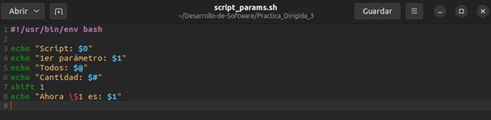

- Se crea el archivo `script_params.sh` y se pone la cabecera portable `#!/usr/bin/env bash`.
- `echo "Script: $0"`: muestra el nombre del script.
-   `echo "1er parámetro: $1"`: muestra el primer parámetro.
-   `echo "Todos: $@"`: muestra todos los parámetros.
-   `echo "Cantidad: $#"`: muestra cuántos parámetros hay.
-   `shift 1`: elimina el primer parámetro (los siguientes se corren).
-   `echo "Ahora \$1 es: $1"`: muestra el nuevo primer parámetro después del `shift`.

**Ejecución:**

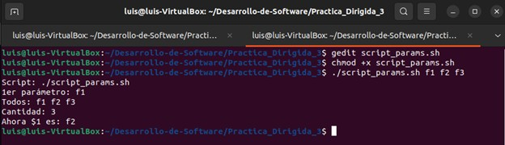

### Paso 5: Arrays en Bash

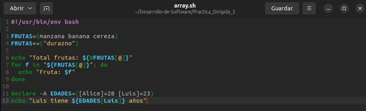

-   Se crea el archivo `array.sh` y se añade la cabecera portable `#!/usr/bin/env bash`.
-   `FRUTAS=(manzana banana cereza)`: crea un array con 3 frutas.
-   `FRUTAS+=("durazno")`: agrega un nuevo elemento al array en la parte final del array.
-   `echo "Total frutas: ${#FRUTAS[@]}"`: imprime la cantidad total de frutas en el array.
-   `for f in "${FRUTAS[@]}"; do ... done`: recorre el array e imprime cada fruta.
-   `declare -A EDADES=([Alice]=28 [Luis]=23)`: declara un array asociativo, con nombres como claves y edades como valores.
-   `echo "Luis tiene ${EDADES[Luis]} años"`: accede al valor asociado de la clave `Luis` y lo imprime.

**Ejecución:**

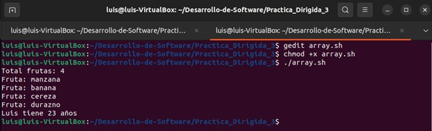

### Paso 6: Expansiones

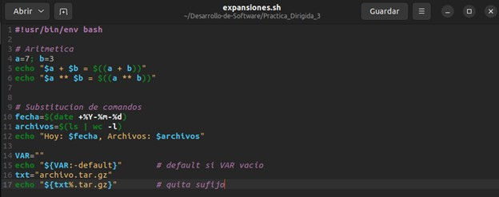

-   `a=7; b=3`: asigna valores a las variables `a` y `b`.    
-   `echo "$a + $b = $((a + b))"`: muestra la suma de `a` y `b`, notar el doble paréntesis.    
-   `echo "$a ** $b = $((a ** b))"`: muestra la potencia de `a` elevado a `b`.    
-   `fecha=$(date +%Y-%m-%d)`: guarda la fecha actual con formato `AAAA-MM-DD` en la variable `fecha`.    
-   `archivos=$(ls | wc -l)`: cuenta la cantidad de archivos (`wc`) en el directorio actual y lo guarda en la variable `archivos`.    
-   `VAR=""`: variable `VAR` como cadena vacía.    
-   `echo "${VAR:-default}"`: imprime `default` si `VAR` está vacío o no definida.    
-   `txt="archivo.tar.gz"`: asigna un nombre de archivo con doble extensión.    
-   `echo "${txt%.tar.gz}"`: elimina el sufijo `.tar.gz` de la variable `txt`.

**Ejecución:**

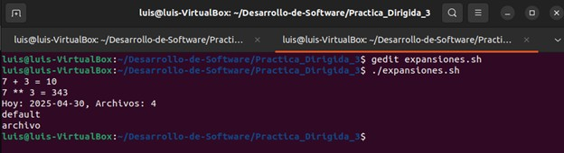

### Paso 7: Pipes y redirección

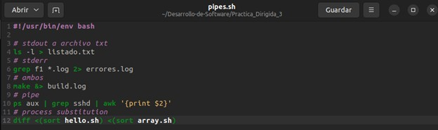

-   `ls -l > listado.txt`: redirige la salida del comando `ls -l` al archivo `listado.txt`.    
-   `grep f1 *.log 2> errores.log`: redirige la salida de error (stderr) de `grep` al archivo `errores.log`.    
-   `make &> build.log`: redirige stdout y stderr al mismo tiempo al archivo `build.log`.    
-   `ps aux | grep sshd | awk '{print $2}'`: usa un pipe para:    
    -   mostrar procesos (`ps aux`)      
    -   filtrar los que contienen (`grep sshd`)        
    -   y extraer el PID (segunda columna) con `awk`        
-   `diff <(sort hello.sh) <(sort array.sh)`: usa sustitución de procesos para comparar el contenido ordenado de dos scripts (`hello.sh` y `array.sh`) sin crear archivos temporales.

**Ejecución:**

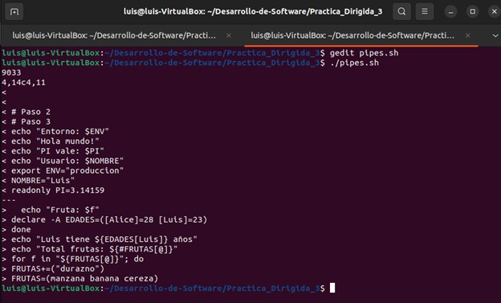

### Paso 8: Condicionales

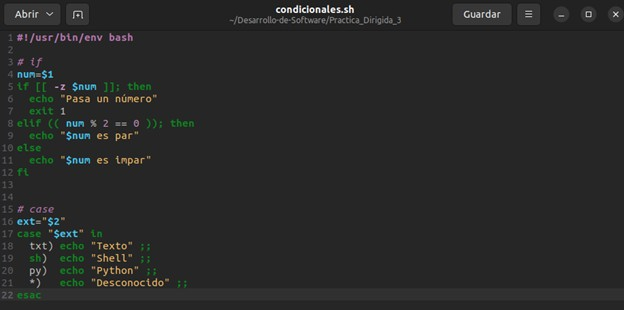

-   `if [[ -z $num ]]; then`: verifica si `num` está vacío, o sea, cuando no se pasó argumento.    
-   `exit 1`: termina el script con código de error.    
-   `elif (( num % 2 == 0 )); then`: verifica si es par.    
-   `ext="$2"`: guardar el segundo argumento.    
-   `case "$ext" in`: comienza la estructura de selección:
    -   `txt) echo "Texto" ;;`: si es `txt`, imprime "Texto"        
    -   `sh) echo "Shell" ;;`: si es `sh`, imprime "Shell"        
    -   `py) echo "Python" ;;`: si es `py`, imprime "Python"        
    -   `*) echo "Desconocido" ;;`: si no coincide con nada, imprime "Desconocido".

**Ejecución:**

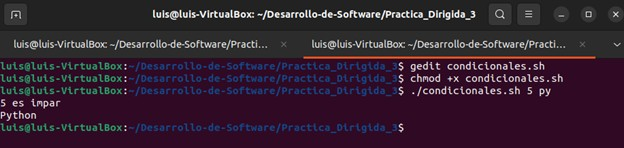

### Paso 9: Bucles

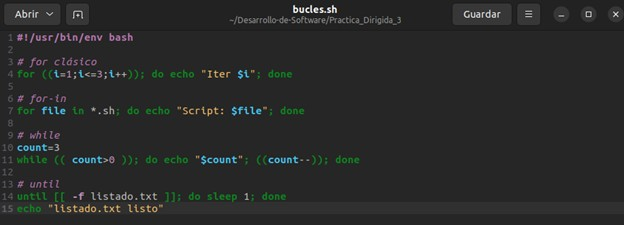

-   `for ((i=1;i<=3;i++)); do echo "Iter $i"; done`: bucle `for`. Imprime "Iter 1", "Iter 2", "Iter 3".
-   `for file in *.sh; do echo "Script: $file"; done`: bucle `for-in`. Recorre todos los archivos `.sh` del directorio actual e imprime sus nombres.
-   `while (( count>0 )); do echo "$count"; ((count--)); done`: bucle `while`. Imprime 3, 2, 1. Descuenta `count` hasta que llegue a 0.
-   `until [[ -f listado.txt ]]; do sleep 1; done`: bucle `until`. Espera hasta que exista el archivo `listado.txt`, va revisando cada segundo.

**Ejecución:**

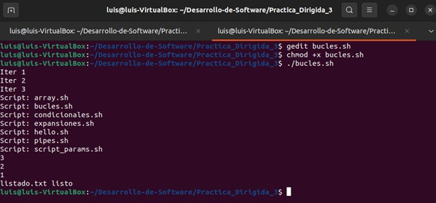

### Paso 10: Funciones

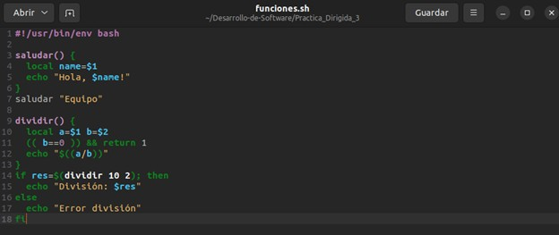

-   `saludar() { ... }`: función que imprime un saludo.    
	-   `local name=$1`: variable local con el nombre. 
-   `saludar "Equipo"`: llama a la función con "Equipo".    
-   `dividir() { ... }`: función que divide dos números.    
	-   `local a=$1 b=$2`: variables locales.    
	-   `(( b==0 )) && return 1`: si `b` es 0, retorna error.  
-   `if res=$(dividir 10 2); then`: intenta dividir y guarda resultado si todo va bien.    

**Ejecución:**

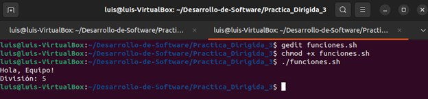

### Paso 11: Depuración

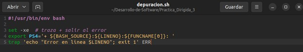

-   `set -xe`:    
    -   `-x`: muestra cada comando antes de ejecutarlo (modo traza)      
    -   `-e`: hace que el script se detenga si ocurre un error        
-   `export PS4='+ ${BASH_SOURCE}:${LINENO}:${FUNCNAME[0]}: '`:  
    Personaliza el prefijo de la traza (`set -x`) para mostrar:    
    -   el archivo (`${BASH_SOURCE}`)        
    -   la línea (`${LINENO}`)        
    -   la función (`${FUNCNAME[0]}`)      
-   `trap 'echo "Error en línea $LINENO"; exit 1' ERR`:  
    Si ocurre un error en cualquier comando, muestra en qué línea fue y termina el script.

### Paso 12: Expresiones regulares en Bash

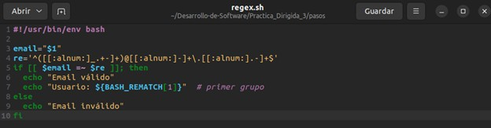

-   `email="$1"`: guarda el primer argumento como dirección de email.    
-   `re='^([[:alnum:]_.+-]+)@[[:alnum:]-]+\.[[:alnum:].-]+$'`: expresión regular para validar emails y capturar el nombre de usuario.
	-  `[[:alnum:]_.+-]`: letras, números, guion bajo, punto, más y guion.
	- `[[:alnum:]-]+`: dominio, solamente letras, números y guiones.
-   `if [[ $email =~ $re ]]; then`: verifica si el email cumple con el patrón.    
-   `echo "Usuario: ${BASH_REMATCH[1]}"`: muestra la primera parte del regex (antes del `@`).    

**Ejecución:**

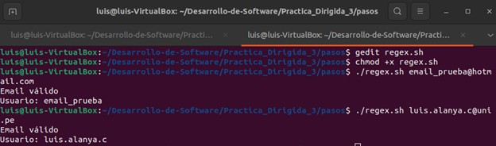

### Paso 13: Expresiones regulares en Python

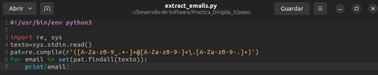

-   `import re, sys`: importa los módulos de expresiones regulares (`re`).    
-   `texto=sys.stdin.read()`: lee todo el texto, desde la entrada estándar (se puede usar con un pipe).    
-   `pat=re.compile(...)`: compila una expresión regular para buscar emails.                   
-   `for email in set(pat.findall(texto)):`:    
    -   `pat.findall(texto)`: encuentra todas las coincidencias de emails        
    -   `set(...)`: elimina duplicados        
-   `print(email)`: imprime cada email único encontrado.

**Ejecución:**

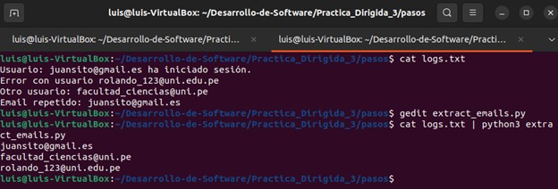

## Ejercicios

### Ejercicio 1

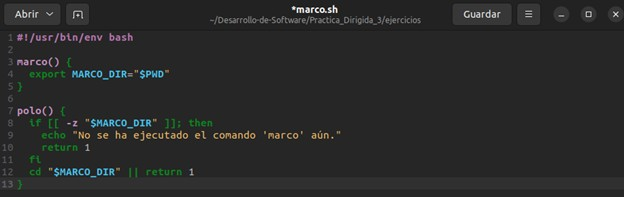

-   `marco() { ... }`: define una función.    
-   `export MARCO_DIR="$PWD"`: guarda el directorio actual en una variable de entorno, `MARCO_DIR`.
-   `polo() { ... }`: define otra función.    
-   `if [[ -z "$MARCO_DIR" ]]; then ...`: verifica si no se ha definido `MARCO_DIR`.    
-   `cd "$MARCO_DIR"`: si existe, cambia al directorio guardado previamente.    
-   `|| return 1`: si falla el `cd`, retorna error.

**Ejecución:**

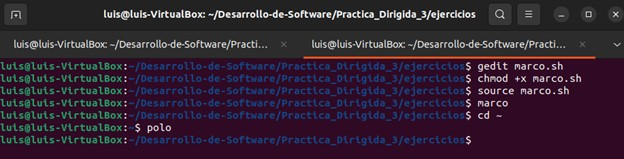

### Ejercicio 2

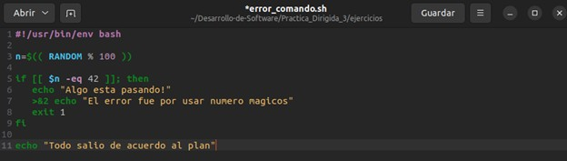

-   `n=$(( RANDOM % 100 ))`: genera un número aleatorio entre 0 y 99 y se guarda en `n`.    
-   `if [[ $n -eq 42 ]]; then`: verifica si el número aleatorio es igual a 42.       
-   `>&2 echo "El error fue por usar numero magicos"`: muestra un mensaje de error por stderr.    
-   `exit 1`: finaliza el script con código de error si el número es 42.    
-   `echo "Todo salio de acuerdo al plan"`: si el número no es 42, imprime que todo fue bien.

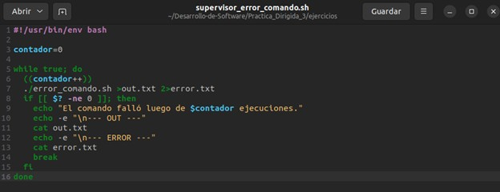

-   `contador=0`: inicializa una variable para contar cuantas veces se ejecuta el comando.    
-   `while true; do`: inicia un bucle infinito.    
-   `((contador++))`: incrementa el contador en cada iteración.    
-   `./error_comando.sh >out.txt 2>error.txt`: ejecuta un script, redirige stdout a `out.txt` y stderr a `error.txt`.    
-   `if [[ $? -ne 0 ]]; then`: verifica si el comando falló (código de salida distinto de 0).   
-   `cat out.txt`: muestra el contenido de `out.txt`.
-   `cat error.txt`: muestra el contenido de `error.txt`.    
-   `break`: sale del bucle al detectar el fallo del comando.

**Ejecución:**

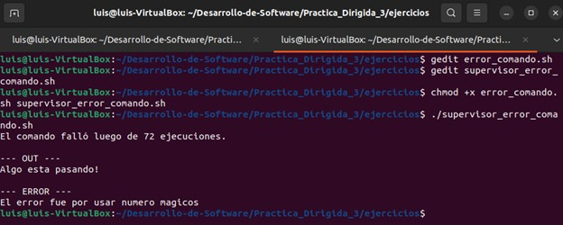

### Ejercicio 3

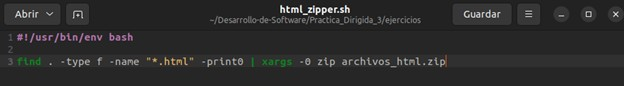

-   `find . -type f -name "*.html" -print0`: busca todos los archivos `.html` en el directorio actual y subdirectorios, se usa`-print0` para separar resultados con `null` (evita errores con espacios).    
-   `xargs -0 zip archivos_html.zip`: pasa los archivos encontrados a `zip`, usando `-0` para leer entradas separadas por `null`.

**Ejecución:**

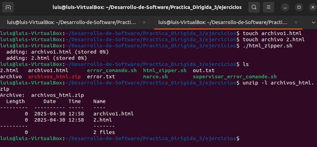

### Ejercicio 4

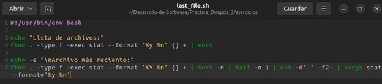

-   `find . -type f -exec stat --format '%y %n' {} + | sort`: lista todos los archivos con fecha y nombre y luego los ordena alfabéticamente.    
-   `find . -type f -exec stat --format '%Y %n' {} +`: obtiene marca de tiempo en segundos.
-   `| sort -n`: ordena los resultados por fecha numérica, los más antiguos arriba.    
-   `| tail -n 1`: toma el archivo último de la lista.    
-   `| cut -d' ' -f2-`: elimina la parte de la fecha en segundos dejando solo el nombre del archivo.    
-   `| xargs stat --format='%y %n'`: muestra fecha legible y nombre del archivo más reciente.

**Ejecución:**

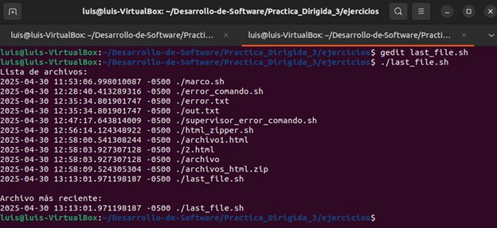

## Problemas

### Problema 1: Script de limpieza de ramas y atashes en Git

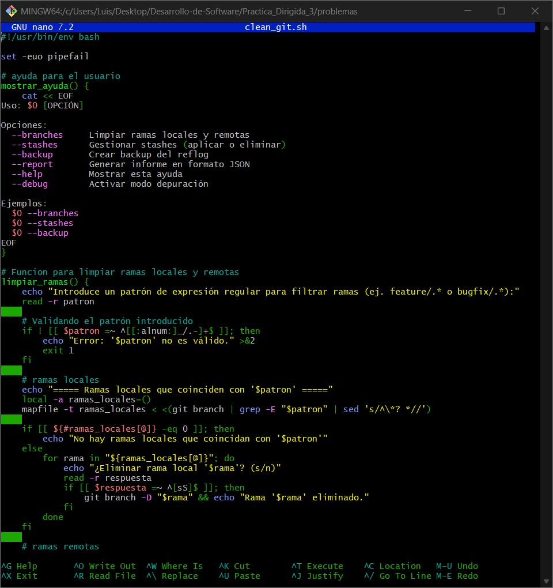

-   `set -euo pipefail`: activa modo estricto: error si variable no definida, comando falla, o tubería falla.    
-   `git branch | grep -E "$patron"`: filtra ramas locales según expresión regular.    
-   `git branch -D "$rama"`: elimina rama local forzadamente.    
-   `git push origin --delete "$rama"`: elimina rama remota.    
-   `git stash list | nl`: muestra stashes numerados.    
-   `git stash apply "stash@{$i}"`: aplica un stash por índice.    
-   `git stash drop "stash@{$i}"`: elimina un stash por índice.    
-   `git reflog | grep -E "reset|merge"`: filtra eventos importantes del historial.    
-   `git tag | jq -R -s -c 'split("\n")[:-1]'`: convierte tags a JSON.    
-   `set -x` + `export PS4=...`: activa traza detallada con línea y función.

### Problema 2: Hook Pre-Commit y generador de reporte en Bash

-   `set -euo pipefail`: para ejecución segura.    
-   `--branches`: limpia ramas locales y remotas con expresión regular.    
-   `--stashes`: permite aplicar o eliminar stashes por índice.    
-   `--backup`: crea un archivo con eventos relevantes del `reflog`.    
-   `--report`: genera un informe en formato JSON.    
-   `git branch` y `git branch -r`: filtran ramas por patrón.    
-   `git branch -D` y `git push origin --delete`: eliminan ramas.    
-   `git stash list | nl`: muestra stashes numerados.    
-   `git stash apply` y `git stash drop`: gestionan stashes seleccionados.    
-   `git reflog | grep -E "reset|merge"`: guarda historial relevante.    
-   `git tag` y `git submodule`: se convierten a JSON con `jq`.
-   `set -x` y `PS4=...`: activan modo depuración detallado.

